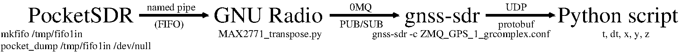
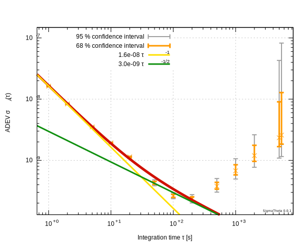
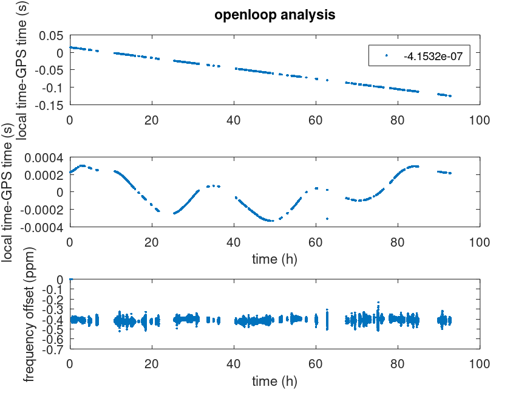
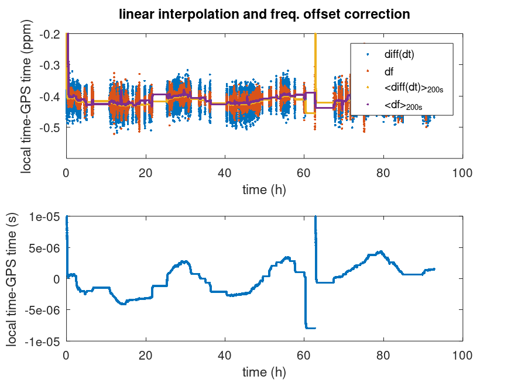
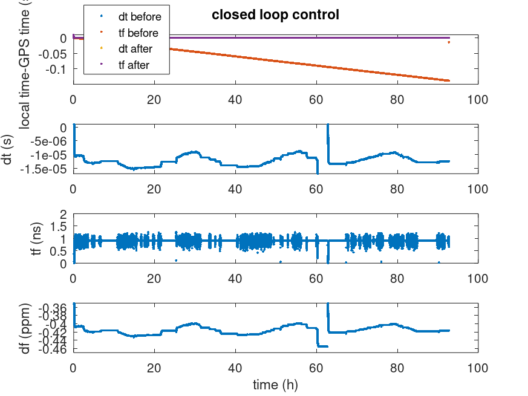

## TCXO stability v.s GNSS

### Communication setup



1. create a FIFO with
```
mkfifo /tmp/fifo1in
chmod 777 /tmp/fifo1in
```
2. configure the MAX2771 for 8 MS/s and 2 MHz IF, and check PocketSDR configuration
```
sudo app/pocket_conf/pocket_conf pocket_L1L1_8MHz.conf
sudo app/pocket_conf/pocket_conf
```
3. launch PocketSDR acquisition
```
sudo app/pocket_dump/pocket_dump /tmp/fifo1in /dev/null
```
4. launch GNU Radio frequency transposition and FIFO to ZeroMQ Pub conversion
```
MAX2771_transpose.py
```
5. launch ``gnss-sdr`` for GNSS ZeroMQ Sub acquisition and signal processing
```
gnss-sdr -c ZMQ_GPS_1_grcomplex.conf
```
6. collect results broadcast by ``gnss-sdr`` through UDP port 1234 and enjoy
```
python3 ./jmf.py > record
```
7. analyze the result
```
cut -d\  -f2,3,7 record | sed 's/dt=//g' | sed 's/TOW=//g' | sed 's/df=//g' > dt
```
and with GNU/Octave (summarized and expanded in ``process.m``):
```
dt=dlmread('dt');
k=find(abs(dt(:,2))>2E-10);dt=dt(k,:);
k=find(diff(dt(:,2))>10e-3);
for l=1:length(k)
  dt(k(l)+1:end,2)=dt(k(l)+1:end,2)-20e-3; % 20 ms jumps
end
subplot(311);plot((dt(:,1)-dt(1,1))/1000/3600,dt(:,2),'.')
[a,b]=polyfit((dt(:,1)-dt(1,1))/1000,dt(:,2),1);
a(1)
ylabel('local time-GPS time (s)');legend(num2str(a(1)))
res=dt(:,2)-b.yf;
subplot(312);plot((dt(:,1)-dt(1,1))/1000/3600,res,'.');
xlabel('time (h)');ylabel('local time-GPS time (s)')
y=[(dt(:,1)-dt(1,1))/1000 res];
subplot(313);plot((dt(:,1)-dt(1,1))/1000/3600,dt(:,end),'.');
xlabel('time (h)');ylabel('frequency offset (ppm)')
save -ascii y y
```
and using SigmaTheta:
```
X2Y y
SigmaTheta y.ykt
```
results in



See below for the raw data.

Compare with the results of https://hamsci.org/sites/default/files/publications/2020_TAPR_DCC/N8UR_GPS_Evaluation_August2020.pdf: 
4e-9 at 1s for the Zed-F9P, 1E-8 at 1s for NEO-M8*

The Allan deviation minimizes at $\tau=200$ s so the time constant of the control loop implemented as $y(n+1)=y(n)+b.(x(n)-y(n-1))$
with $b=1-d$ where $\tau=-1/\ln(d)$ or $d=\exp(-1/\tau)=exp(-1/200)=0.995$ so that $b=5e-3$ (see https://tomroelandts.com/articles/low-pass-single-pole-iir-filter for the detailed demonstration)


### Protobuf management in Python

The script ``jmf.py`` is using ``monitor_pvt_pb2.py`` which was generated from ``gnss-sdr/docs/protobuf`` by running
```
protoc monitor_pvt.proto --cpp_out=. --python_out=.
```
and requires the Debian package ``python3-protobuf``. The ``from monitor_pvt_pb2 import MonitorPvt`` comes from reading
``gnss-sdr/docs/protobuf/monitor_pvt.proto`` starting with ``message MonitorPvt ...``

Make sure to *enable* ``PVT.enable_protobuf=true`` in the ``gnss-sdr`` configuration file 

### Raw data results

Three hour continuous acquisition allowing for the display of the Allan deviation:


$>24$ hour record with signal loss by gnss-sdr:


### Closed loop estimate

From the openloop measurement:
1. the data were linearly interpolated to compensate for missing measurements (time offset smaller vers 0.1 ns or unlocked gnss-sdr)
and filtered using an IIR with time constant of 200 s (minimum of the Allan deviation on a continuous measurement)



2. the frequency offset was applied to the openloop measurements to correct for TCXO inaccuracy (openloop correction)



3. a closed loop control was applied on the measured time delay to compensate for TCXO frequency offset and cancel the time delay


