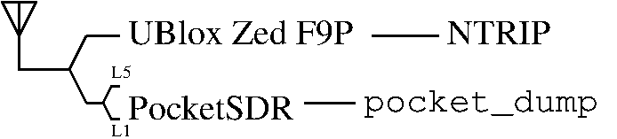

## Dual channel reception (channel1 lower band, channel2 upper band)

Objective: time difference between UBlox Zed-F9P and ``gnss-sdr`` generated RINEX from PocketSDR:



# Configuration definition

Select lower L-band on channel1:
```
[CH1]
LNAMODE         =       1  # LNA mode selection (0:high-band,1:low-band,2:disable)
MIXERMODE       =       1  # Mixer mode selection (0:high-band,1:low-band,2:disable)
FBW             =       1  # IF filter BW (0:2.5MHz,1:8.7MHz,2:4.2MHz,3:23.4MHz,4:36MHz,7:16.4MHz)
F3OR5           =       1  # Filter order selection (0:5th,1:3rd)
FCENX           =       0  # Polyphase filter selection (0:lowpass,1:bandpass)
LOBAND          =       1  # Local oscillator band selection (0:L1,1:L2/L5)
```
with an IF frequency of 4 MHz since $24*(48+893474/2^{20})=1172.449997~1176.45-4$ MHz:
```
INT_PLL         =       0  # PLL mode control (0:fractional-N,1:integer-N)
NDIV            =      48  # PLL integer division ratio (36-32767): F_LO=F_XTAL/RDIV*(NDIV+FDIV/2^20)
RDIV            =       1  # PLL reference division ratio (1-1023)
FDIV            =  893474  # PLL fractional division ratio (0-1048575)
```
and a sampling rate of 8 MS/s since $24*2048/(4096-0+2048)=8$:
```
PREFRACDIV_SEL  =       1  # Clock pre-divider selection (0:bypass,1:enable)
REFCLK_L_CNT    =    2048  # Clock pre-divider L counter value (0-4095): L_CNT/(4096-M_CNT+L_CNT)
REFCLK_M_CNT    =       0  # Clock pre-divider M counter value (0-4095)
ADCCLK          =       0  # Integer clock div/mul selection (0:enable,1:bypass)
REFDIV          =       3  # Integer clock div/mul ratio (0:x2,1:1/4,2:1/2,3:x1,4:x4)
FCLKIN          =       0  # ADC clock divider selection (0:bypass,1:enable)
ADCCLK_L_CNT    =       0  # ADC clock divider L counter value (0-4095): L_CNT/(4096-M_CNT+L_CNT)
ADCCLK_M_CNT    =       0  # ADC clock divider M counter value (0-4095)
```

Similarly for channel 2, select upper L-band:
```
[CH2]
LNAMODE         =       0  # LNA mode selection (0:high-band,1:low-band,2:disable)
MIXERMODE       =       0  # Mixer mode selection (0:high-band,1:low-band,2:disable)
FBW             =       1  # IF filter BW (0:2.5MHz,1:8.7MHz,2:4.2MHz,3:23.4MHz,4:36MHz,7:16.4MHz)
F3OR5           =       1  # Filter order selection (0:5th,1:3rd)
FCENX           =       0  # Polyphase filter selection (0:lowpass,1:bandpass)
LOBAND          =       0  # Local oscillator band selection (0:L1,1:L2/L5)
```
with an IF frequency of 4 MHz since $24*(65+498948/2^{20})=1571.420013~1575.42-4$ MHz:
```
INT_PLL         =       0  # PLL mode control (0:fractional-N,1:integer-N)
NDIV            =      65  # PLL integer division ratio (36-32767): F_LO=F_XTAL/RDIV*(NDIV+FDIV/2^20)
RDIV            =       1  # PLL reference division ratio (1-1023)
FDIV            =  498948  # PLL fractional division ratio (0-1048575)
```
and a sampling rate of 8 MS/s (same as before).

# Processing

```bash
str2str -in ntrip://caster.centipede.fr:2101/ENSMM -out file://sortie.bin
sudo ./app/pocket_conf/pocket_conf conf/pocket_L5L1_8MHz_4MHz.conf   # configure PocketSDR
sudo ./app/pocket_conf/pocket_conf                                   # check configuration
sudo ./app/pocket_dump/pocket_dump -t 300 1.bin 2.bin                # acquire 5 min (8 MS/s x 2 channels = 4.8 GB))
python3 ../python/pocket_acq.py -f 8 -fi 4 -sig L1CA -prn 1-32 2.bin 
python3 ../python/pocket_acq.py -f 8 -fi 4 -sig E1B  -prn 1-35 2.bin 
python3 ../python/pocket_acq.py -f 8 -fi 4 -sig E5AI -prn 1-35 1.bin 
python3 ../python/pocket_acq.py -f 8 -fi 4 -sig L5I  -prn 1-32 1.bin 
gnss-sdr -c File_Galileo_E1_char.conf
gnss-sdr -c File_Galileo_E5_char.conf
gnss-sdr -c File_GPS_L1_char.conf
convbin sortie.bin
rinex-cli/target/release/rinex-cli --fp galileoE1.25O diff ublox.25O   # see https://github.com/georust/rinex/tree/main/tutorials/DIFF
rinex-cli/target/release/rinex-cli --fp gps.25O diff ublox.25O   # see https://github.com/georust/rinex/tree/main/tutorials/DIFF
rinex-cli/target/release/rinex-cli --fp WORKSPACE/galileoE1/DIFFERENCED.25O filegen --csv
rinex-cli/target/release/rinex-cli --fp WORKSPACE/gps/DIFFERENCED.25O filegen --csv
```
