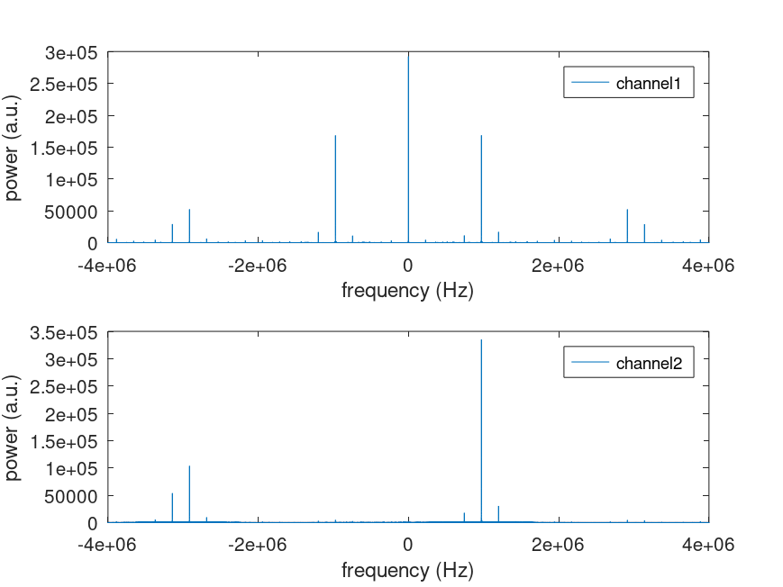
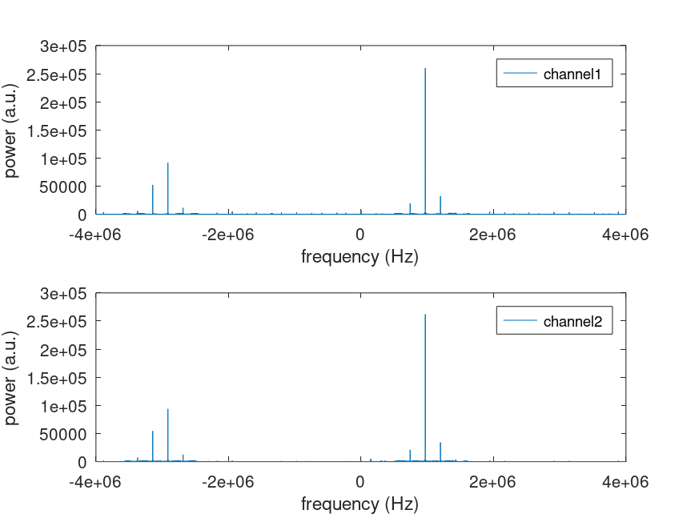
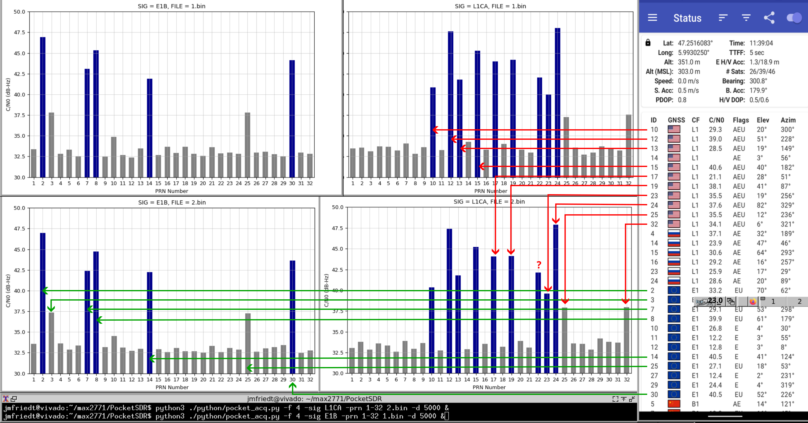

# Complex IQ stream

All measuremnts prior to this date were performed with an intermediate frequency due to
a damaged FX2LP board in which PB3 (most significant bit of Q of channel 1) was damaged
and always read 0, leading to an erroneous (even) spectrum. After replacing the FX2LP
board, the baseband complex records with 0-IF are correct and allow for decoding GNSS signals.

Damaged board with most significant bit of Q of channel 1 always reading 0, leading to an 
even spectrum: synthesizer set to 1573.45 MHz at -80 dBm, recording at 1574.42 MHz using
<a href="pocket_L1L1_8MHz.conf">pocket_L1L1_8MHz.conf</a>.

Corrected board with I and Q correcty read, leading to the same specta on MAX2771 1 and 2:
even spectrum: synthesizer set to 1573.45 MHz at -80 dBm.

GNSS signal decoding after recording a complex baseband signal at 4 MS/s, configured with
<a href="pocket_L1L1_4MHz.conf">pocket_L1L1_4MHz.conf</a>:

