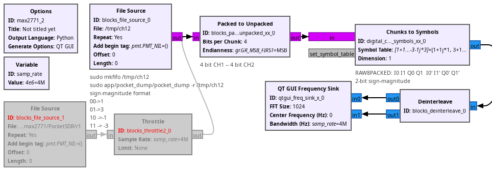

## Reading the PocketSDR output for real time display in GNU Radio Frequency Sink

```
sudo mkfifo /tmp/ch12  # needed for sudo access
sudo cycfx2prog prg:../FX2LP/complete_fw/build/complete_fw.ihx run
cd PocketSDR/
sudo ./app/pocket_conf/pocket_conf pocket_L1L1_4MHz.conf 
sudo ./app/pocket_dump/pocket_dump -r /tmp/ch12
```



See https://www.youtube.com/watch?v=9ugML8JjXIQ for a demonstration of GNU Radio decoding in real time PocketSDR signals.

