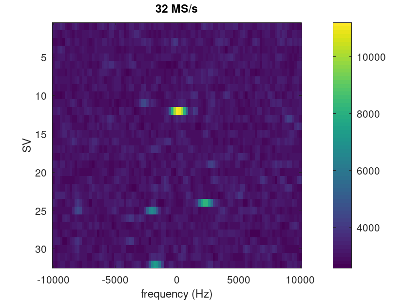
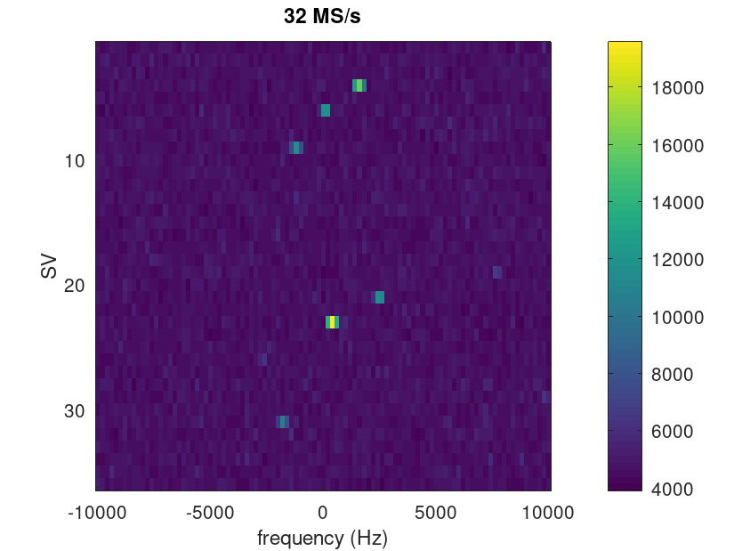
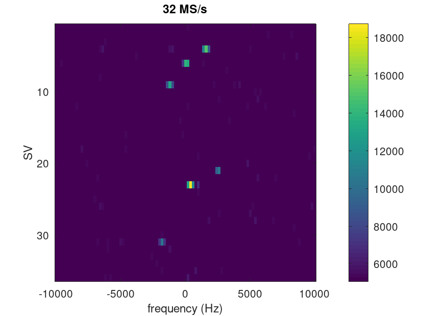
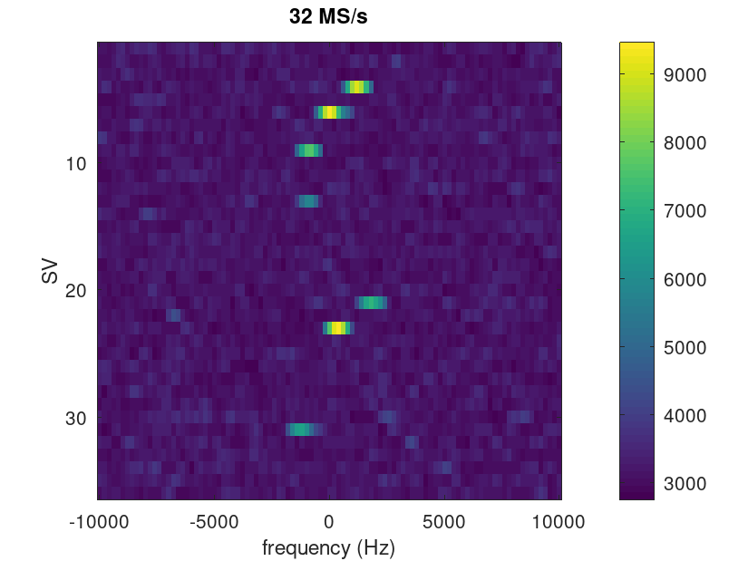
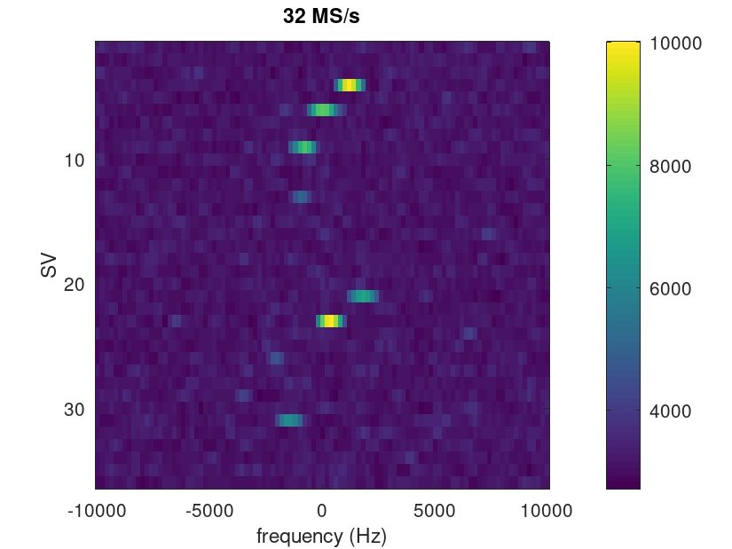
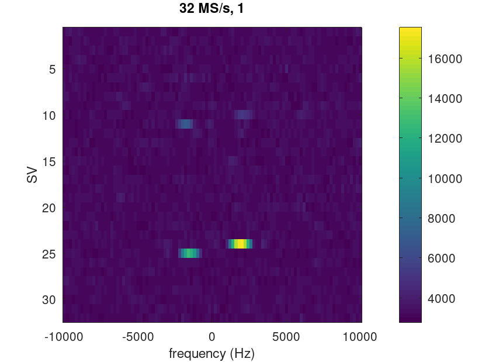
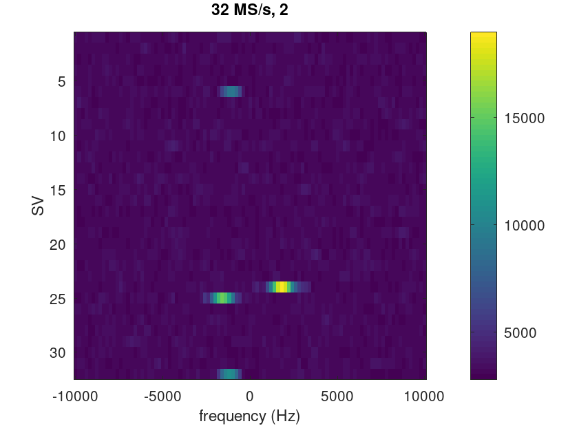
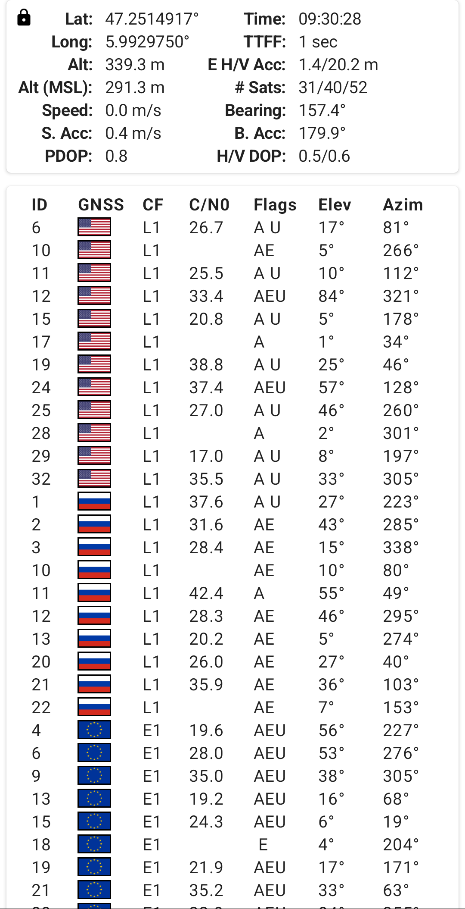

Data collected using PocketSDR configuration
```
sudo app/pocket_conf/pocket_conf conf/pocket_L1L5_32MHz.conf
app/pocket_dump/pocket_dump -t 1 1h.bin 2l.bin
``` 
and processed using the GNU Octave scripts:

``correlate_gpsL1_char.m``



``correlate_galileo1B_char.m`` and ``correlate_galileo1C_char.m``




``correlate_galileoE5_char.m``




``correlate_gpsL5_char.m``




matching the observed constellation


