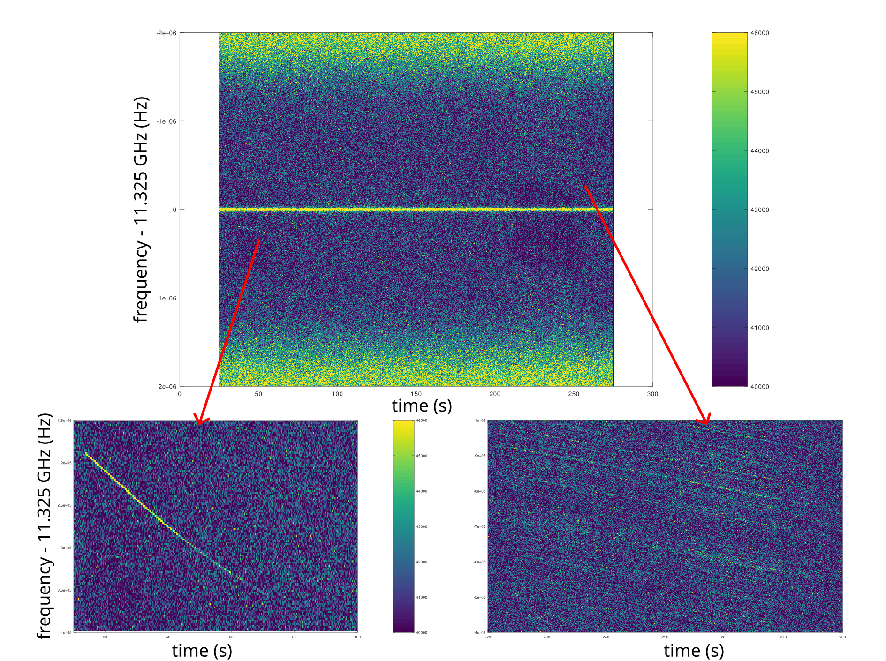
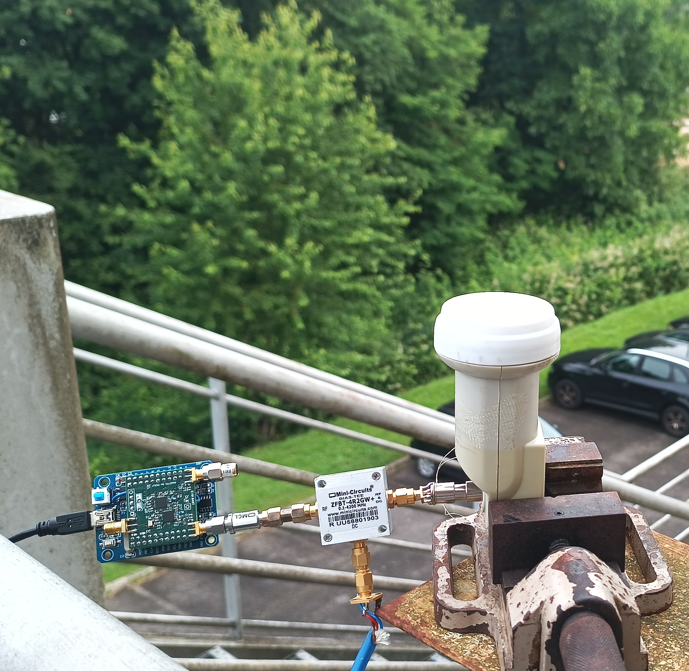

## Receiving Starlink beacon signals with the MAX2771

Satellite-TV Low Noise Block (LNB) receivers are fitted with a 9.75 GHz local
oscillator. When receiver the 11.325 GHz beacon signal from Starlink, the
output signal is at 11.325-9.75=1.575 GHz which is nearly exactly the GPS L1 band.

Using the provided <a href="pocket_L1L1_4MHzstarlink.conf">configuration file</a>, the following recording was visible
from Besancon in France on June 3, 2025.



with the following setup:



and the following processing script

```Matlab
% https://www.rtl-sdr.com/receiving-starlink-beacons-with-an-rtl-sdr-and-lnb/
fs=4e6;     % sampling rate
count=2048  % FFT length
avg=256     % averaging factor
P=floor(2399928320/count/avg/2) % file length

dt=count*avg/fs;
f=fopen('/tmp/2.bin' , 'rb');
s=zeros(count,P);
for m=1:P-2
  m
  for k=1:avg
    t = fread (f, [2, count], 'char');
    v = t(1,:) + t(2,:)*i;
    [r, c] = size (v);
    v = reshape (v, c, r);
    if (exist('freq')==0)
       freq=linspace(-fs/2,fs/2,length(v));
    end
    s(:,m)=s(:,m)+abs(fftshift(fft(v-mean(v))));
  end
end
fr=linspace(-fs/2,fs/2,count);
temps=linspace(0,300,size(s)(2))
imagesc(temps,fr,abs(s),[40000 46000])
colorbar
xlabel('time (s)')
ylabel('frequency offset (f-11.325 GHz)')
fclose (f);
% axis([10 100 1.50e5 4e5])
% axis([220 280 -1.e6 -4e5])
```
