## Link budget

25 kW ERP = 74 dBm

TX to RXref distance = 4840 m

$FSPL=20log_{10}(490\cdot 10^6)+20log_{10}(4840)-147.55=100 dB$

74-100=-26 dBm excluding Yagi-Uda receiving antenna gain

P1dB(MAX2771)=-85 dBm !

## Experimental setup

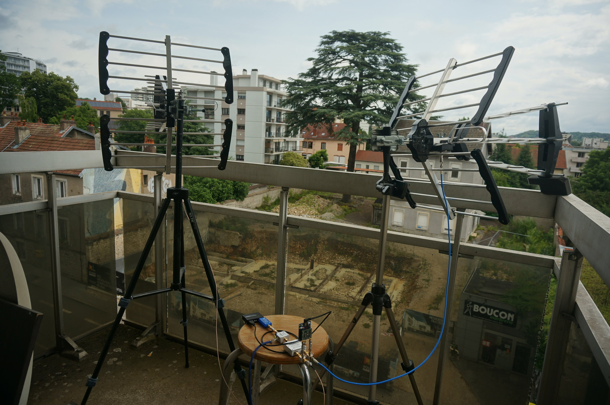
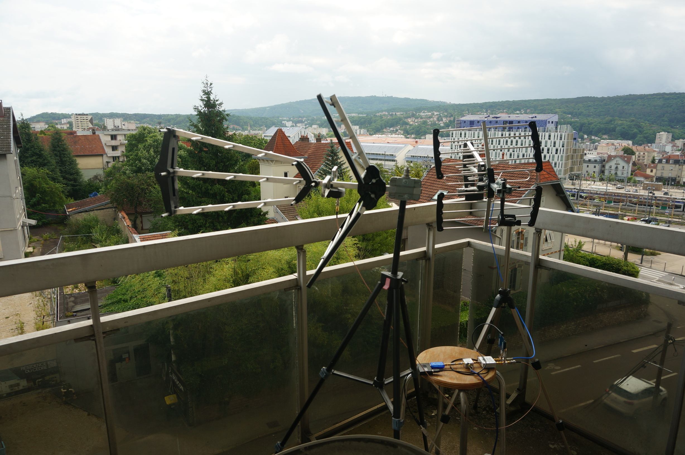
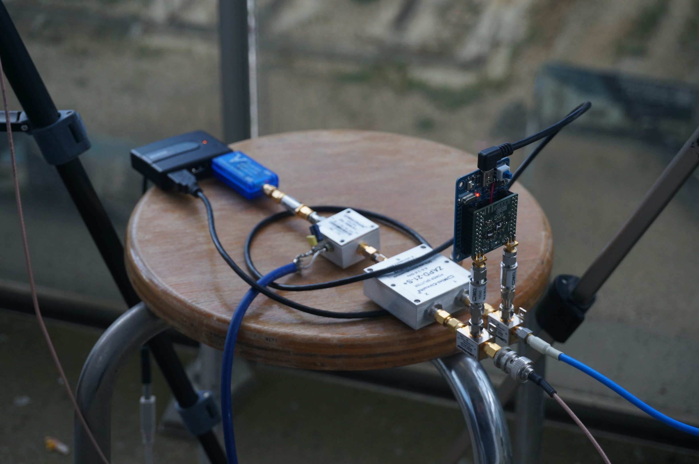

## Acquisition results

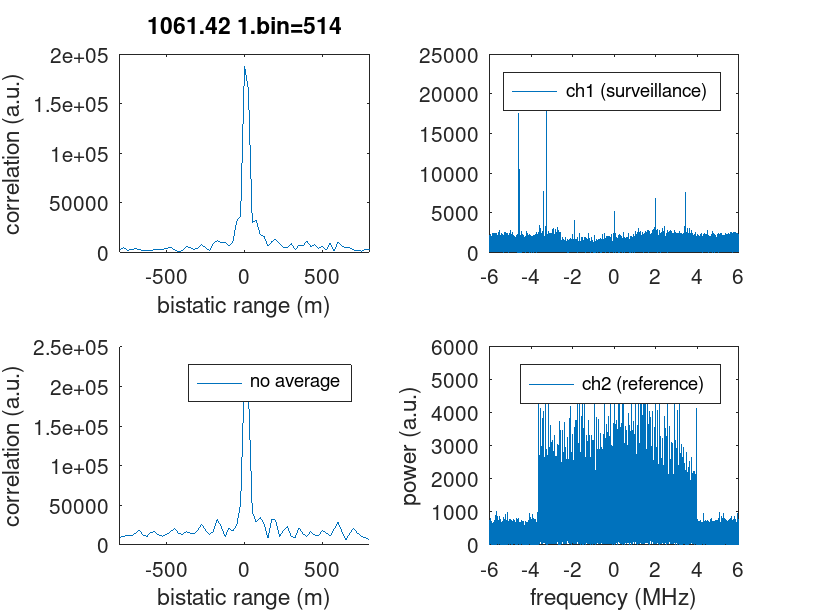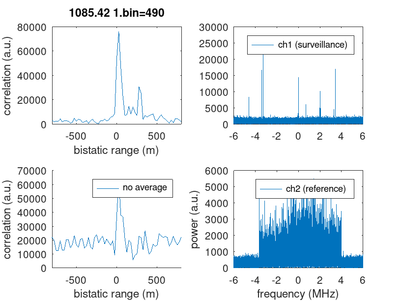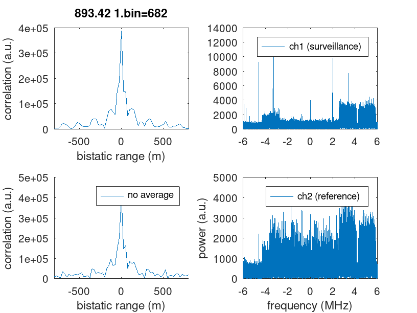
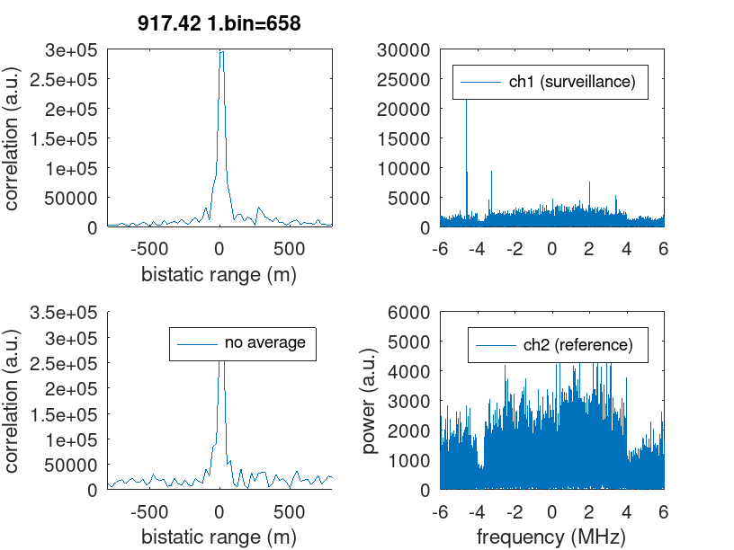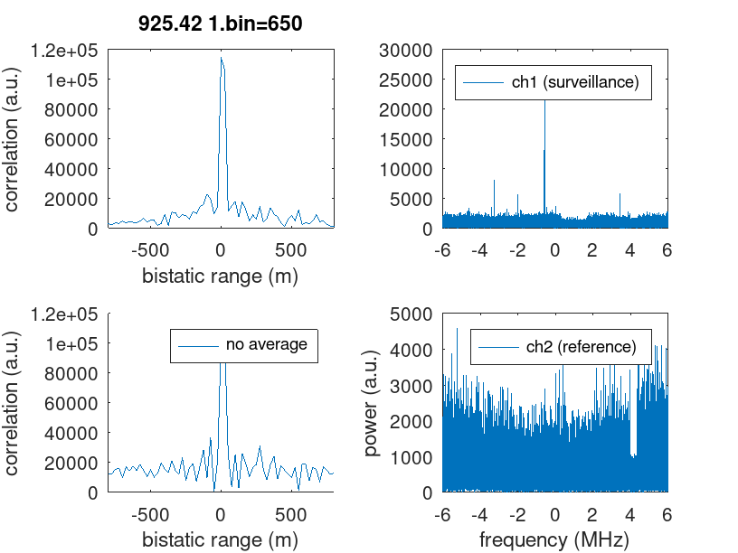

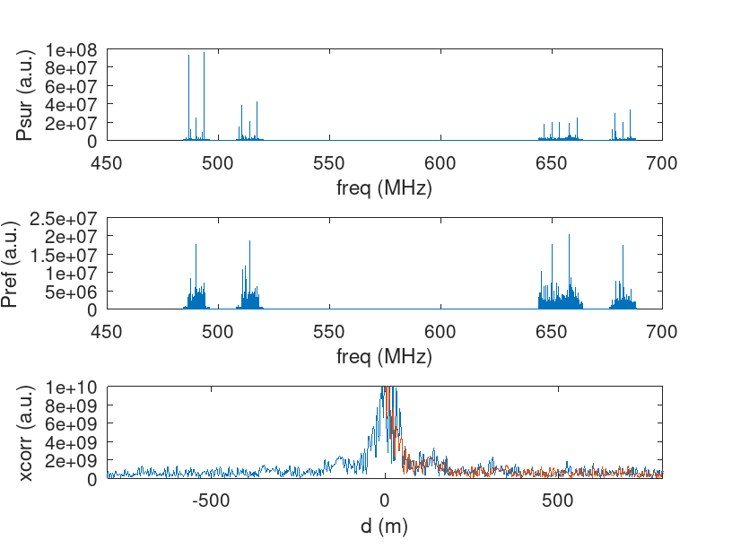

## Displying the bistatic range ellipse in QGis:

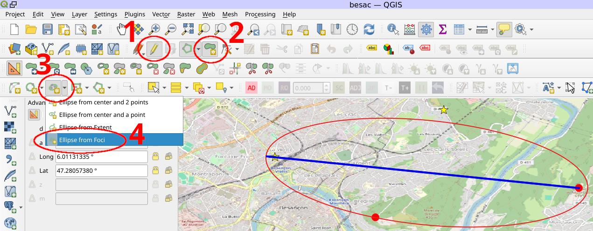

```
Layer -> Create Layer -> New Shapefile Layer (Geometry Type: Polygon)

Pen Icon to Toggle Editing (also in the Layer Menu)

View -> Toolbars -> Advanced Digitizing Toolbar (enable)

Add Polygon Feature

Ellipse from Foci
```


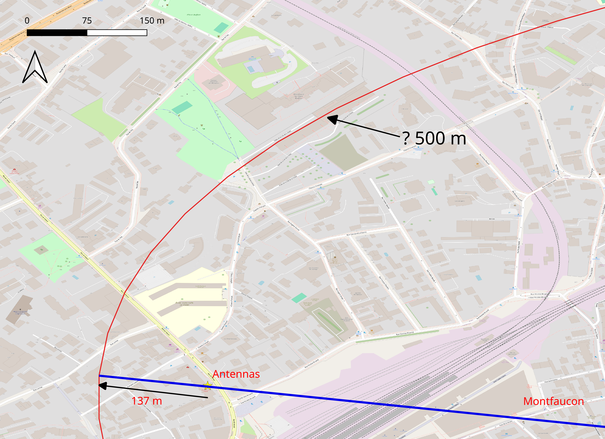
