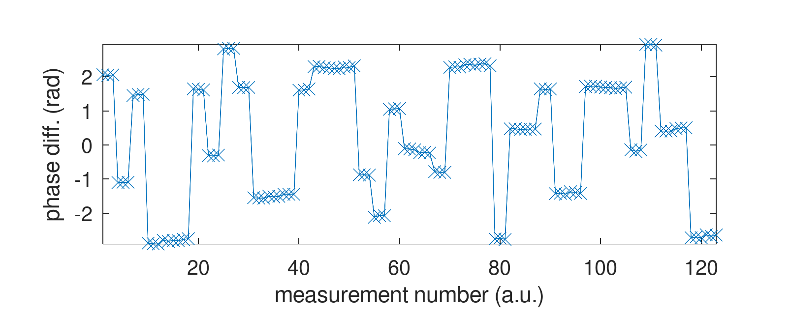

# Phase stability between two MAX2771 clocked with the same source

* Phase coherence is lost if programming from upper to lower or lower to
upper L-band.
* Phase coherence is lost when starting from cold-starting (power up) a 
new acquisition.
* Phase seems to be kept when streaming continuously IQ (ZMQ Publish) and
programming within the upper or lower L-band.
* Phase acquisition is kept when retarting a new acquisition (``pocket_dump``)
without powering down the circuit.

## Powering on and off the circuit (on Raspberry Pi 4 to be able to control USB power)

In the following chart, 40 successive acquisitions were performed, each repeating
three successive data collections (``pocket_dump``) before powering off and on the
circuit. The phase sequence is seen to be packed with three nearby successive phase
values before jumping to a new random value after powering off and on:

## Programming the PLL between upper and lower L-band

## Programming the PLL within the upper L-band

The measurements were repeated by reprogramming between two upper L-bands alternatively.

Same with timestamped X-axis and thermal camera pictures of the chip illustrating how it
is warming up during phase drift:

