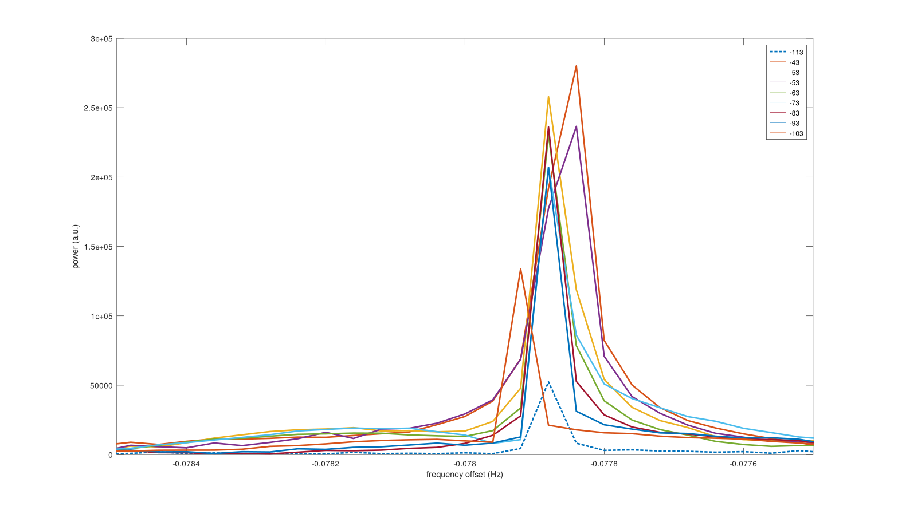
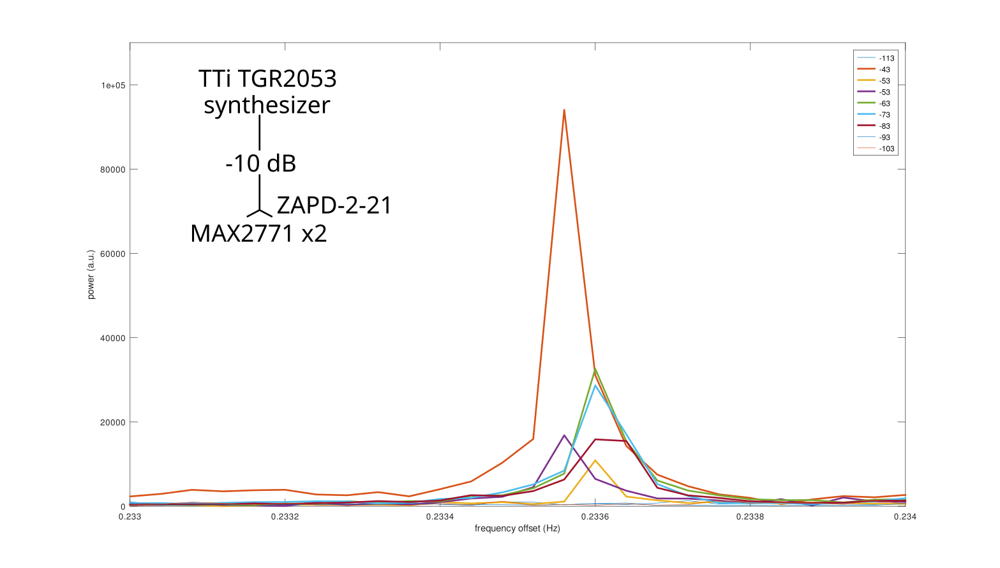

## Input power leading to LNA non-linear behaviour

Synthesizer frequency setting: 1575.500 MHz

MAX2771: auto gain control, frequency setting 1575.420 MHz

Power from -100 to -30 (followed by 10 db attenuator and 3 dB splitter)

The FFT peak appears at -80 kHz: Q sign reversed, flipping the frequency axis



Non linearity appearing for input powers above -83 dBm (LNA included in the reception chain), matching the datasheet statement that the P1dB point of the 
LNA is -85 dBm:



## Phase difference stability between MAX2771 reeivers

The phase between the two MAX2771 (rx1 and rx2) differs from one run to another (power off/power
on and reconfigure, or even two acquisitions without reconfiguring, cf ``m90_1b1`` and ``m90_1b2``:

```
filename    freq. rx1 freq. rx2     phase diff
m100_1.bin:  -0.077876 -0.077876 ->  0.135894
m30_1.bin:   -0.077857 -0.077857 -> -0.858964
m40_1a.bin:  -0.077868 -0.077868 ->  2.390532
m40_1b.bin:  -0.077857 -0.077857 ->  0.207820
m50_1.bin:   -0.077872 -0.077872 ->  2.920453
m60_1.bin:   -0.077872 -0.077872 -> -0.037123
m70_1.bin:   -0.077873 -0.077873 -> -0.539539
m80_1.bin:   -0.077877 -0.077877 -> -2.497095
m90_1a.bin:  -0.077918 -0.077918 -> -1.398426
m90_1b1.bin: -0.077912 -0.077912 -> -2.788829
m90_1b2.bin: -0.078531 -0.078531 ->  0.614426
m90_1c.bin:  -0.077907 -0.077907 ->  0.271576
m90_1d.bin:  -0.077908 -0.077908 -> -0.776840
m90_1e.bin:  -0.077885 -0.077885 ->  0.743283
m90_1f.bin:  -0.077882 -0.077882 -> -2.478639
m90_1g.bin:  -0.077882 -0.077882 -> -3.025754
```
