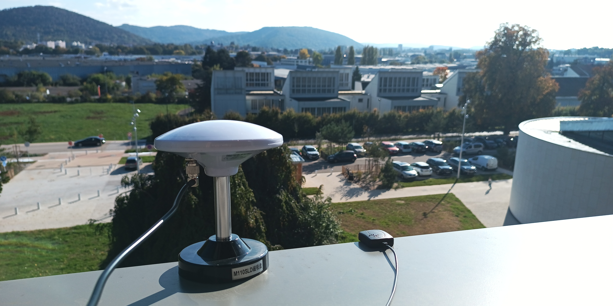
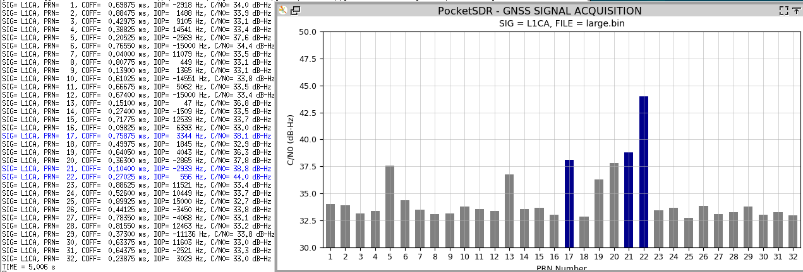
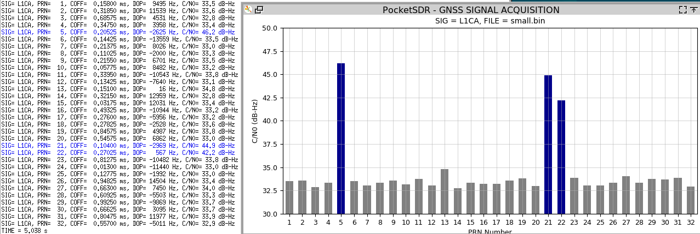
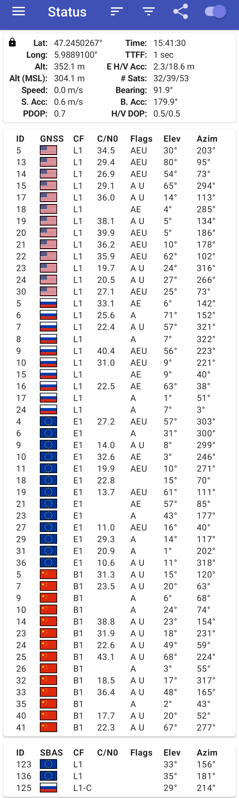

```
PocketSDR/app/pocket_dump$ sudo ../pocket_conf/pocket_conf ../../conf/pocket_L1L1_4MHz.conf 
Pocket SDR device settings are changed.
PocketSDR/app/pocket_dump$ sudo ../pocket_conf/pocket_conf | head -5
#
#  Pocket SDR device settings (MAX2771)
#
#  [CH1] F_LO = 1575.420 MHz, F_ADC =  4.000 MHz (IQ), F_FILT =  0.0 MHz, BW_FILT =  2.5 MHz
#  [CH2] F_LO = 1575.420 MHz, F_ADC =  0.000 MHz (IQ), F_FILT =  0.0 MHz, BW_FILT =  2.5 MHz
PocketSDR/app/pocket_dump$ sudo ./pocket_dump -t 300 251012_small.bin 251012_large.bin
  TIME(s)    T   CH1(Bytes)   T   CH2(Bytes)   RATE(Ks/s)
    300.0   IQ   2400059392  IQ   2400059392       4000.0
jmfriedt@rugged:~/sdr/max2771/PocketSDR/app/pocket_dump$ ls -l *bin
-rw-r--r-- 1 root root 2.3G Oct 12 15:49 251012_large.bin
-rw-r--r-- 1 root root 2.3G Oct 12 15:49 251012_small.bin
PocketSDR/app/pocket_dump$ python3 ../../python/pocket_acq.py -f 4 -d 15000 -sig L1CA -prn 1-32 251012_large.bin
PocketSDR/app/pocket_dump$ python3 ../../python/pocket_acq.py -f 4 -d 15000 -sig L1CA -prn 1-32 251012_small.bin
```



```
PocketSDR/app/pocket_dump$ python3 ../../python/pocket_acq.py -f 4 -d 15000 -sig E1B -prn 1-33 251012_small.bin
```



```
PocketSDR/app/pocket_dump$ python3 ../../python/pocket_trk.py -f 4 -sig L1CA -prn 1-33 251012_large.bin
 TIME(s):      8.30                                                            SRCH:   0  LOCK:  7/ 32
 CH  SAT   SIG PRN  LOCK(s) C/N0 (dB-Hz)         COFF(ms) DOP(Hz)    ADR(cyc) SYNC  #NAV #ERR #LOL NER
  5  G05  L1CA   5     8.29 40.4 ||||||         0.2190574 -2627.6    -21810.4 -B--     0    0    0   0
 13  G13  L1CA  13     8.29 39.6 ||||||         0.1506266    71.1       592.4 -B--     0    0    0   0
 17  G17  L1CA  17     8.29 39.2 ||||||         0.7413621  3318.8     27496.3 -B--     0    0    0   0
 19  G19  L1CA  19     8.29 35.1 |||            0.6195437  3969.9     32905.8 -B--     0    0    0   0
 20  G20  L1CA  20     8.29 40.2 ||||||         0.3779855 -2860.5    -23757.4 -B--     0    0    0   0
 21  G21  L1CA  21     8.29 38.3 |||||          0.1198381 -2995.6    -24854.4 -B--     0    0    0   0
 22  G22  L1CA  22     8.29 45.5 ||||||||||     0.2671932   563.1      4660.5 -B--     0    0    0   0
```

but lacking the Doppler shift range information in ``pocket_trk``, we update ``PocketSDR/src/sdr_ch.c`` with
```
#define MAX_DOP    29500.0   // max Doppler for acquisition (Hz)
```
and
```
#define DOP_STEP      0.2   // Doppler frequency search step (* 1 / code cycle)
```



``gnss-sdr -c File_GPS_L1_char.conf`` states 
```
Current receiver time: 1 min 27 s
New GPS NAV message received in channel 5: subframe 2 from satellite GPS PRN 13 (Block IIR) with CN0=43 dB-Hz
New GPS NAV message received in channel 3: subframe 2 from satellite GPS PRN 22 (Block IIR) with CN0=44 dB-Hz
New GPS NAV message received in channel 4: subframe 2 from satellite GPS PRN 05 (Block IIR-M) with CN0=39 dB-Hz
New GPS NAV message received in channel 2: subframe 2 from satellite GPS PRN 21 (Block IIR) with CN0=40 dB-Hz
```
and
```
Current receiver time: 3 min 57 s
New GPS NAV message received in channel 5: subframe 2 from satellite GPS PRN 13 (Block IIR) with CN0=42 dB-Hz
New GPS NAV message received in channel 3: subframe 2 from satellite GPS PRN 22 (Block IIR) with CN0=45 dB-Hz
New GPS NAV message received in channel 4: subframe 2 from satellite GPS PRN 05 (Block IIR-M) with CN0=36 dB-Hz
New GPS NAV message received in channel 11: subframe 2 from satellite GPS PRN 17 (Block IIR-M) with CN0=38 dB-Hz
```
but lacks SNR to converge to a PVT solution.
