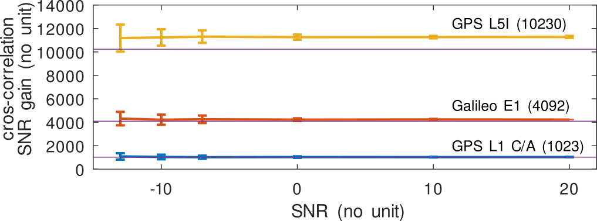
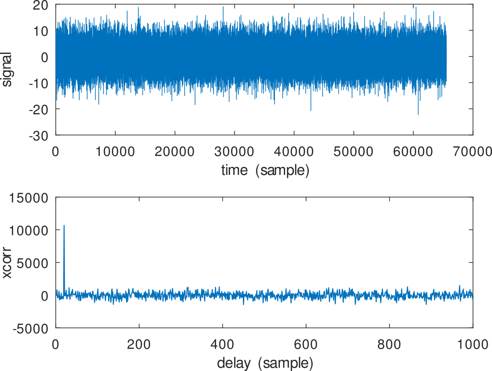

# Demonstration of pulse compression SNR gain

When a known pattern is broadcast (either localy regenerated or recorded on a 
second coherent channel), cross-correlating the noisy signal with this pattern
allows for improving the SNR by a factor equal to the number of chips in the
pattern.

The Octave script demonstrates this concept, resulting in the following charts:

