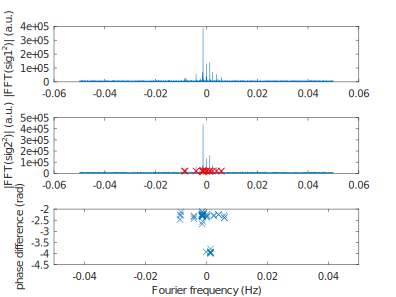

### Case of a PlutoSDR clocked by an external OCXO

A high quality (stable and accurate) [HP 10544](http://www.leapsecond.com/museum/10544/1972-Oct-hp-10544A.pdf)
10 MHz double-ovenized crystal oscillator is used to clock the PlutoSDR avec two-times multiplication by
2 to reach 40 MHz.

