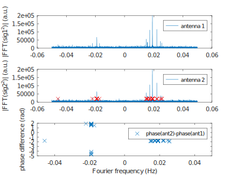

### Case of a PlutoSDR clocked by its internal TCXO

The frequency source is inaccurate, leading to a bias on the frequency offset observed
for the satellites. Nevertheless, all spoofing signals exhibit the same phase difference
between antennas, and the spectral components with different phase values are attributed
to MAX2771 spurious rather than GNSS signals.

```
pluto-gps-sim$ sudo ./pluto-gps-sim  -e hour1790.23n  -A -65 -t 2023/06/28,12:00:00 -l 48.3621221,-4.8223307,100 -U usb:3.29.5
Using static location mode.
Gain: -65.0dB
RINEX date = 28-JUN-23 12:42     
Start time = 2023/06/28,12:00:00 (2268:302400)
PRN   Az    El     Range     Iono
01  272.0  49.4  21052322.7   4.6
02  287.1  67.6  20923913.4   3.8
03  208.3  13.7  24263590.3  11.1
08  144.5  68.4  20648270.7   4.1
10   49.1  31.1  22849975.1   6.1
14  308.8  26.3  23121575.2   5.8
21  307.9  77.6  20636456.6   3.7
22  115.5  17.3  24099494.4  10.2
27  131.6  32.3  22771574.0   7.2
32   94.1  25.6  23356935.7   7.8

PocketSDR$ sudo ./app/pocket_conf/pocket_conf conf/pocket_L1L1_8MHz.conf
Pocket SDR device settings are changed.
PocketSDR$ sudo ./app/pocket_conf/pocket_conf 
#  [CH1] F_LO = 1573.420 MHz, F_ADC =  8.000 MHz (I ), F_FILT =  2.0 MHz, BW_FILT =  2.5 MHz
#  [CH2] F_LO = 1573.420 MHz, F_ADC =  0.000 MHz (I ), F_FILT =  2.0 MHz, BW_FILT =  2.5 MHz
PocketSDR$ sudo rm /tmp/1.bin /tmp/2.bin
PocketSDR$ sudo ./app/pocket_dump/pocket_dump -t 2 /tmp/1.bin /tmp/2.bin
  TIME(s)    T   CH1(Bytes)   T   CH2(Bytes)   RATE(Ks/s)
      2.0    I     15990784   I     15990784       7995.4
```



