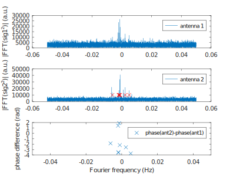
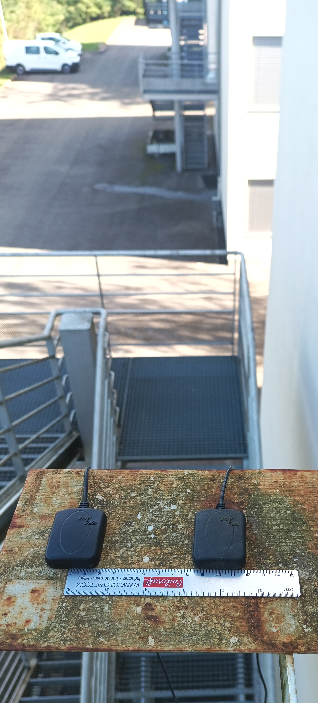

### Case of a genuine constellation signal

When the signal from a genuine GNSS constellation is recorded with two antennas separated
by half wavelength, the direction of arrival is detected through the phase difference between
antennas. Since a genuine constellation is distributed over the celestial sphere, different
direction of arrivals lead to a wide distribution of phases on the detected signal generated
by codeless decoding of the BPSK modulated signal (GPS L1 C/A)



The PocketSDR analysis matches nicely the information provided by the GNSS receiver on a mobile
phone running the Android GPRTest software:


```
python3 ./python/pocket_acq.py ch1.bin -f 8 -fi 2 -sig L1CA -prn 1-32 -f 20000
```

Experimental setup for recording the genuine signals: two GNSS antennas with full view of the sky
are connected to the dual-MAX2771 board:


