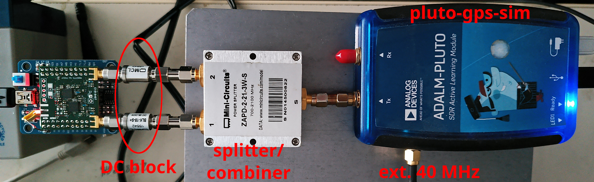
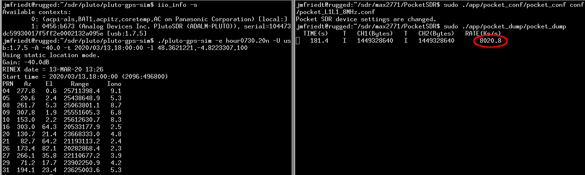
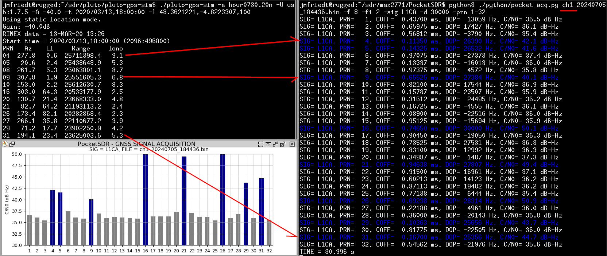
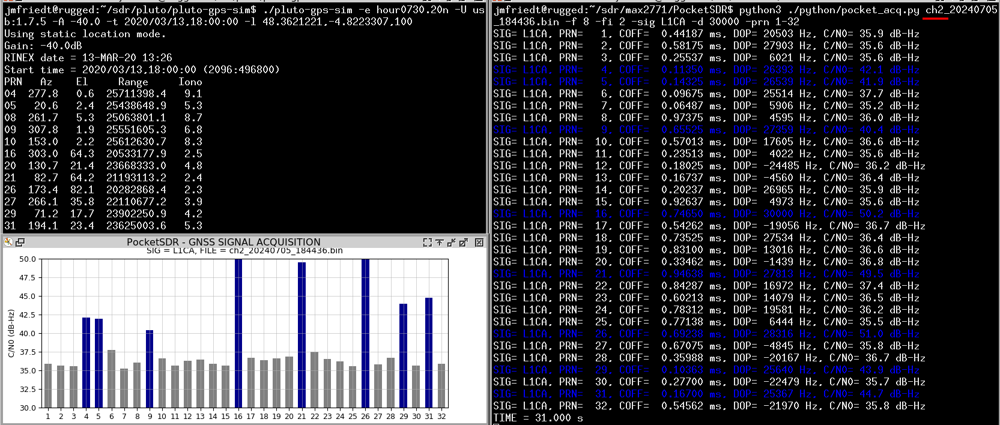
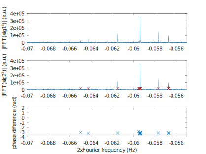

GPS L1 signal generated by a PlutoSDR thanks to ``pluto-gps-sim``, feeding both inputs
of the board fitted with two MAX2771

The screenshots of the ``pluto-gps-sim`` output indicating which SV signals are broadcast,
and the resulting data collection by the FX2LP

Executing ``python3 PocketSDR/python/pocket_acq.py`` on the resulting datasets leads to

with the correct Space Vehicles (SVs) identified in both files.

Plotting the phase of the squared signals

 

shows that all signals exhibit the same direction of arrival, a strong signature of 
a spoofing attack.
