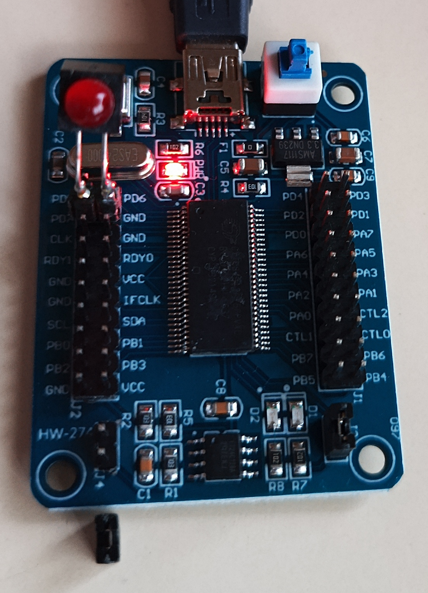
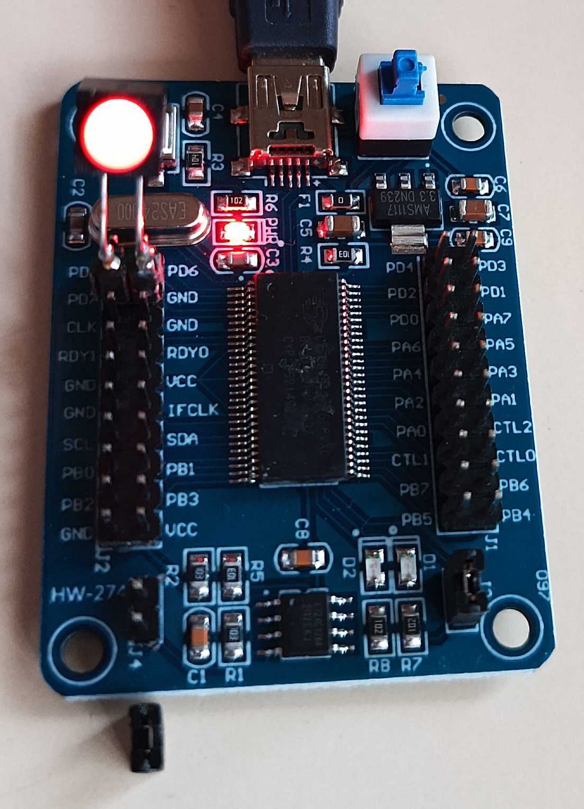

## Blinking LED example
1. Closing the jumper to the right (when the USB connector is facing upward) next to the on-board LEDs,
compile with ``make`` and transfer to RAM for execution with ``make flash`` (requires ``sudo`` privilege)
to execute the program from RAM. The two on-boards LEDs should blink alterately evey 1 s.

2. Connect a LED between PD7 and GND. Edit the ``Makefile`` and replace the target name with
``MAIN = mainPD``. Compile with ``make`` and transfer to RAM or EEPROM for execution:

