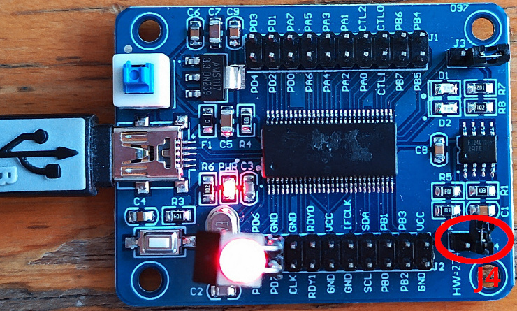
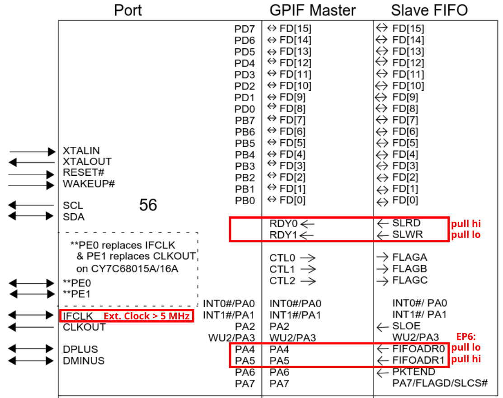

### Bulk access from FX2LP microcontroller to Linux host: device to host

## Execution from RAM



Close J4 jumper, switch off and on (to start in bootloader mode), then
```
make
sudo cycfx2prog prg:build/fifo_ep6.ihx run
lsusb  # Bus 001 Device 009: ID 04b4:1004 Cypress Semiconductor Corp. There
sudo ./bulk_read.py 
```
or
```
sudo ./fx2lp_ep6_in_fifo 
```

## Erase EEPROM and flash program to EEPROM

Close J4 jumper, switch off and on (to start in bootloader mode) and *remove* jumper, then
```
sudo cycfx2prog prg:Vend_Ax.hex run
./read_eeprom.py
```
to invalidate the EEPROM first bytes. Then switch off and back on, and
```
make
sudo ./src/fxload load_eeprom --device 04b4:8613 --ihex-path ../max2771_fx2lp/FX2LP/bulk_read_example/build/fifo_ep6.ihx -t FX2LP --control-byte 0xC2 -s ./resources/Vend_Ax.hex
```
and switch off and back on for executing the program.
 
## Bulk read from C or Python

A host program to read bulk data from End Point 6 of FX2LP:
reads 512 bytes from the device, originally by Siddharth Deore 
(siddharthdeore@gmail.com).

Compiling the host application and executing on GNU/Linux:
```
gcc -o fx2lp_ep6_in_fifo fx2lp_ep6_in_fifo.c -lusb-1.0
lsusb | grep ypress  # ID 04b4:1004 Cypress Semiconductor Corp. There
sudo rmmod usbtest   # might have been automagically loaded by kernel => remove
sudo ./fx2lp_ep6_in_fifo
```
or
```
sudo python3 ./bulk_read.py
```

For this example to operate correctly, the following hardware settings are needed:



