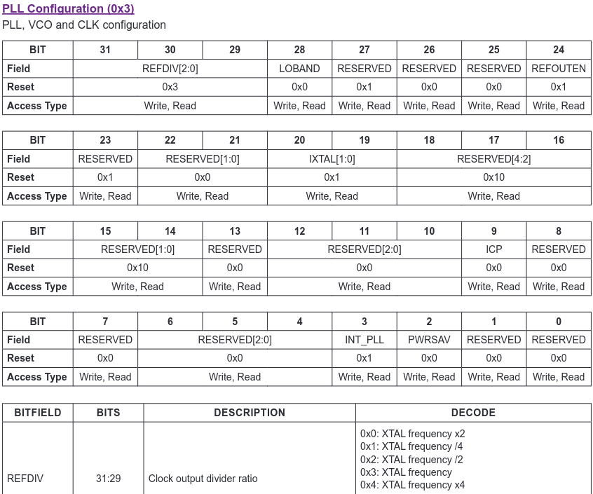
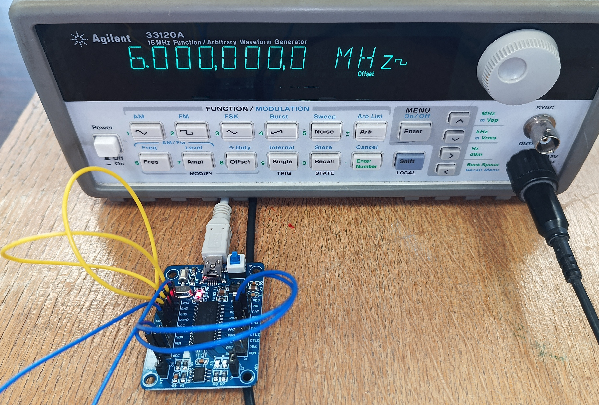

## Complete firmware including Vendor Requests trigger SPI transactions and bulk transfer endpoints

```
sudo cycfx2prog prg:build/complete_fw.ihx run
```
for executing from RAM, or
```
sudo fxload load_eeprom --device 04b4:8613 --ihex-path ./build/complete_fw.ihx -t FX2LP --control-byte 0xC2 -s ../bulk_read_example/Vend_Ax.hex
```
for flashing to non-volatile memory.

Once the program is executing, ``lsusb`` must indicate
```
Bus 001 Device 097: ID 04b4:1004 Cypress Semiconductor Corp. There
```

Warning: ``fx2lib`` provides a ``delay()`` function with an argument in ms, conflicting
with the PocketSDR use of ``delay()`` whose argument is in number of loops.

EEPROM access is included but untested.

Using PocketSDR ``pocket_conf/pocket_conf ../../conf/pocket_L1L1_8MHz.conf`` and then
``pocket_dump/pocket_dump -t 2 1.bin 2.bin`` demonstrates data transfer rates of 8 Msamples/s.
Then, executing ``python3 ./readwrite_PLL.py`` updates the ADC configuration register according to



by doubling the ADC clock (REFDIV from 0x3 for x1 to 0x0 for x2) and running again ``pocket_dump`` this 
time indicates a datarate of 16 Msamples/s, demonstrating that the manipulation of the registers
of the MAX2771 from Python and the SDCC firmware is correctly understood.

# Testing the communication

Even without MAX2771, FX2LP bulk communication can be checked by connecting a square
wave generator to the IFCLK and checking the matching datarate with the PocketSDR
``pocket_dump``



```sh
$ sudo ./pocket_dump -t 1 
  TIME(s)    T   CH1(Bytes)   T   CH2(Bytes)   RATE(Ks/s)
      1.0    I      6029312   I      6029312       5981.5
```

# Changing VID/PID

If two circuits are to be used on the same computer (e.g. dual-frequency CRPA analysis requiring
two dual-MAX2771 boards), the VID/PID on one board must be changed. Since I am unable to figure
out why the ``PID=0x1005`` in the ``Makefile`` has no effect, editing the ``.ihx`` file to change
VID/PID is necessary.

To achieve this result, edit ``build/complete_fw.ihx`` with a text editor and replace
```
:203E000012010002FFFFFF40B40404100100010200010A060002FFFFFF4001000902200004
```
with .e.g (15th byte changed from 04 to 05 since the word order is little endian so that 0410 
represents PID 1004 and 0410 is replaced with 0510)
```
:203E000012010002FFFFFF40B40405100100010200010A060002FFFFFF4001000902200004
```
for the circuit to be identified as (notice the PID as 1005 instead of 1004)
```
Bus 003 Device 044: ID 04b4:1005 Cypress Semiconductor Corp. There
```
