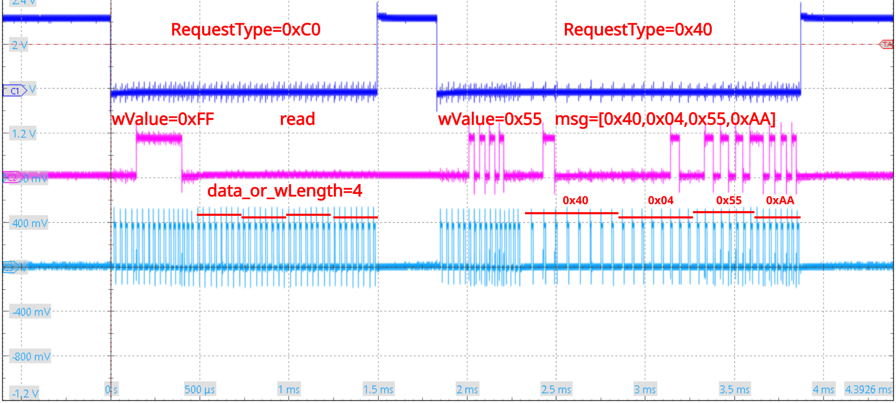
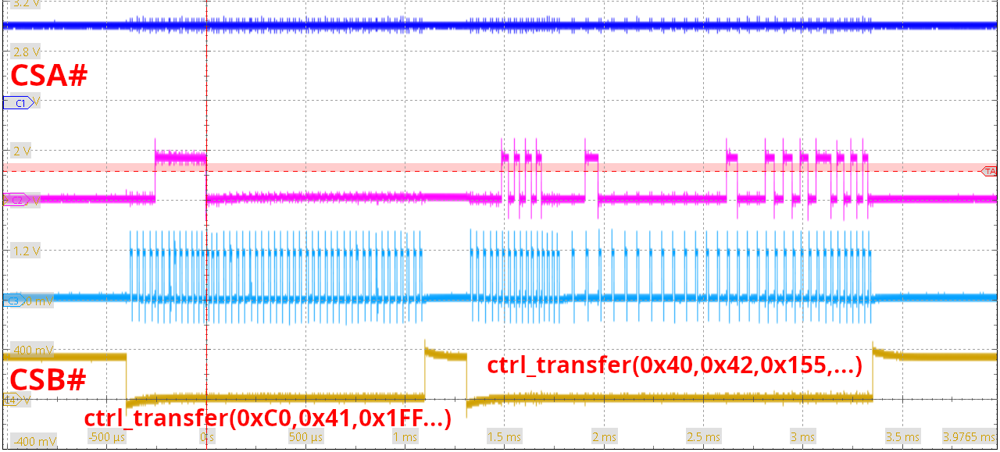
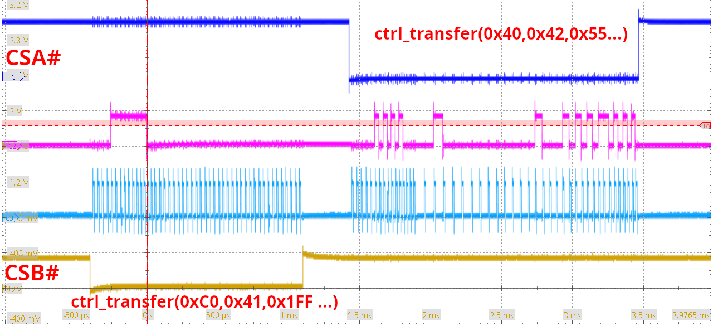
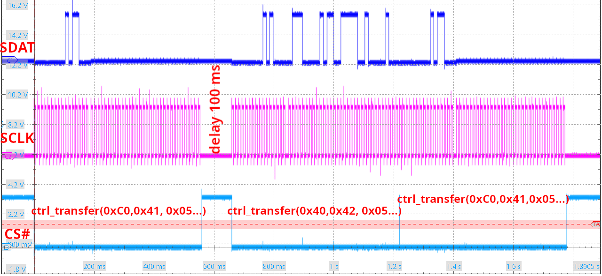

## Bitbanged SPI triggered by USB Vendor Request transactions

### Using the binary PocketSDR firmware compiled with the proprietary Keil compiler

Using a FX2LP started with the EEPROM firmware (closed jumper on EEPROM) and 
programming the PocketSDR firmware with 
```
sudo cycfx2prog prg:PocketSDR/FE_2CH/FW/v2.1/pocket_fw.hex run
```
then we try to understand how SPI communicatin is triggered from USB commands.

From ``PocketSDR/FE_2CH/FW/v2.1/pocket_fw.c`` we learn that calling 
vendor request 0x40 (VR_STAT) returns 6 bytes with
```
EP0BUF[0] = VER_FW;             // F/W version            0x10
EP0BUF[1] = MSB(F_TCXO);        // TCXO Frequency (kHz)   0x5D
EP0BUF[2] = LSB(F_TCXO);                                  0xC0
EP0BUF[3] = digitalRead(STAT1); // MAX2771 CH1 PLL status (0:unlock,1:lock)
EP0BUF[4] = digitalRead(STAT2); // MAX2771 CH2 PLL status (0:unlock,1:lock)
EP0BUF[5] = digitalRead(LED2);  // Bulk transfer status (0:stop,1:start)
```
and indeed executing 
```
$ python3 ./vendor_cmd.py 
b'105dc0010100'
```
returns 0x10 as ``VER_FW``, followed by the hexadecimal representation of 24000 the oscillator
frequency in kHz (0x5DC0) and status bytes.

Running vendor requests 0x41 (read register) and 0x42 (write registers) with wValue the 8-bit
register index, wIndex set to 0 and the last argument set to the written data in case of 0x42
leads to the oscilloscope screenshot (blue is Chip Select, purple is Clock and cyan is MOSI):



with the oscilloscope probes connected to PD0 (CS#), PD2 (SCLK), and PD3 (SDATA). Adding one more
probe (channel 4, yellow) to CSB#, we see that the most significant byte of wValue determines which 
CS# is triggered, with 0x1FF or 0x155 triggering CSB# and 0xFF or 0x55 in wValue triggering CSA#.





Repeating the operation with a FX2LP running from EEPROM the firmware and hence using VID:PID
of 04b4:1004, we read and write register 5 of the MAX2771 to read the default FDIV value, write
the wanted value and read the resulting value to check the value was properly stored

```
$ sudo ./readwrite_FDIV.py 
b'105dc0010101'      # VR_STAT
b'0647ae70'          # read default content of register 5 (MSB no the ones documented in datasheet!)
b'08f25970'          # write new value in register 5
$ sudo ./readwrite_FDIV.py 
b'105dc0010101'      # VR_STAT
b'08f25970'          # read content of register 5: matches the previously written valule
b'08f25970'          # write new value in register 5
```

### Repeating the sdcc opensource compiler and associated libraries

The ``vendor_cmd.c`` example aims at
* providing the Vendor Request services and return information similar to thos of the PocketSDR
firmware (demonstrating we understand how to handle the Vendor Request on the endpoint)
* generate waveforms emulating SPI communication on the GPIOs (for configuring the MAX2771 and
reading the configuration).

```
make                                         # compile vendor_cmd.c to buid/vendor_cmd.ihx
sudo cycfx2prog prg:build/vendor_cmd.ihx run # flash
sudo ./readwrite_FDIV.py                     # validate, with oscilloscope probes on PD2 and PD3
```

The oscilloscope output of the SPI bitbanged bus is as follows, following the reply

```
$ sudo ./readwrite_FDIV.py 
b'105dc0010100'
b'00000000'
b'00000000'
```

demonstrating proper generation of the GPIO signals and transactions over the USB bus with
the firmware compiled using ``sdcc``.


