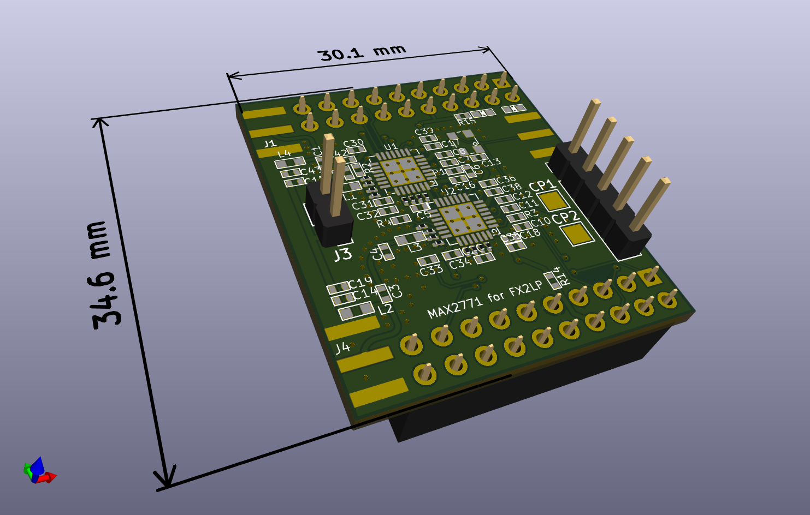
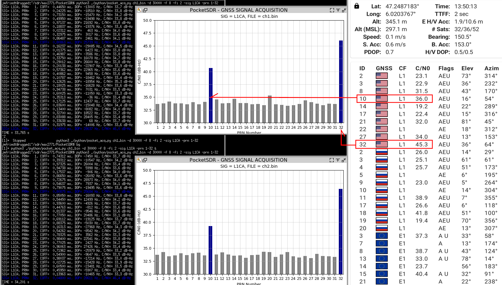
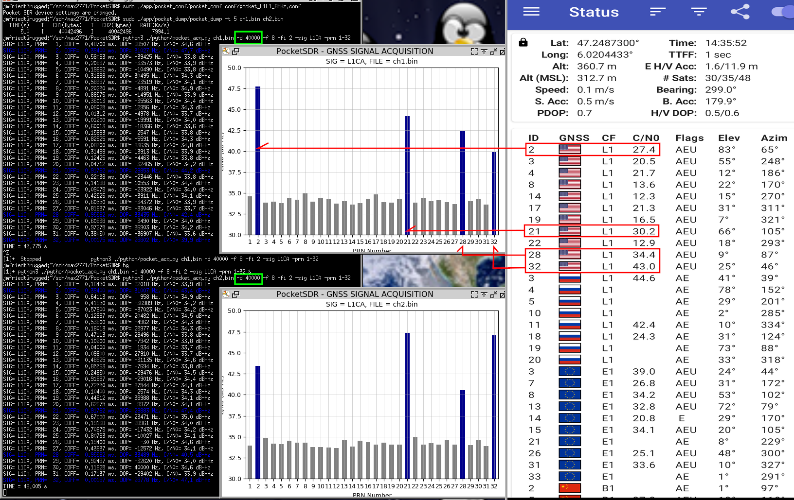
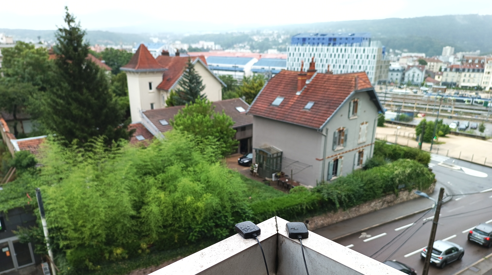

From Tomoji Takasu's Pocket SDR design, v2.3 found at https://github.com/tomojitakasu/PocketSDR, 
to be fitted on https://fr.aliexpress.com/item/1005006134347046.html FX2LP development board:



Schematic:


Notice that the low-pass matching filters L1/C2 and L3/C4 are fitted with 5.6 nH/1.7 pF and
8.4 nH/1.1 pF according to the typical application circuit found on page 49 of the datasheet.
The values are selected for the upper and lower L-band respectively. If both MAX2771 are to be
used in the same band, e.g. for CRPA, then replace the L/C values with the values best suited
for the targeted band.

Board layers (4-layer circuit to match the 50-ohm transmission lines in the L-band):


Use the interactive BOM (in the <a href="bom/">bom/</a> subdirectory) when assembling the board.

Result of the assembled board: configuring both MAX2771 to collect the 
upper (L1) band with 8 MHz sampling rate and 2 MHz IF bandwith
```
sudo ./app/pocket_conf/pocket_conf conf/pocket_L1L1_8MHz.conf
```
and recording using
```
sudo ./app/pocket_dump/pocket_dump -t 5 ch1.bin ch2.bin
```
The two binary files are processed for acquisition of GPS L1 C/A signal with
```
python3 ./python/pocket_acq.py ch2.bin -d 30000 -f 8 -fi 2 -sig L1CA -prn 1-32
```
with the ``-d`` option to reach Doppler shifts up to 30 kHz to account for
the poor quality TCXO whereas the default is to search for 5 kHz (theoretical
Doppler shift maximum assuming a perfect reference clock, e.g. Rb, Cs or HM 
source or good quality OCXO).

First demonstration, Doppler limited to 30 kHz offset from carrier:



Second demonstration, Doppler extended to 40 kHz offset from carrier matching the mobile phone
measurements:



Experimental setup:


