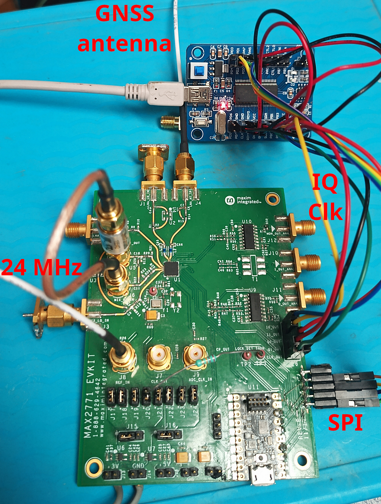
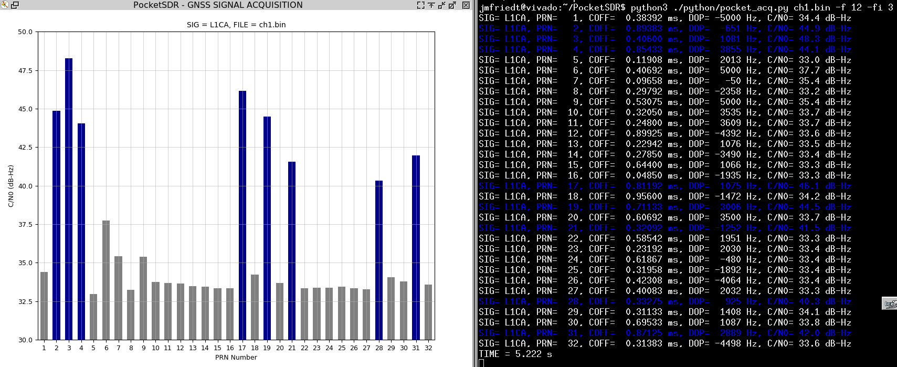
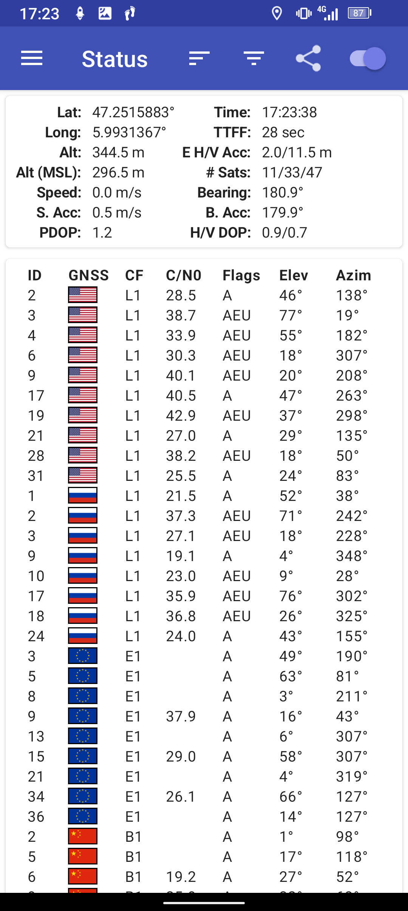

```
sudo ./app/pocket_conf/pocket_conf conf/pocket_L1L6_12MHz.conf 
sudo ./app/pocket_conf/pocket_conf 
sudo ./app/pocket_dump/pocket_dump -r -t 1 ch1.bin ch2.bin             # -r pour ne PAS interleave
python3 ./python/pocket_acq.py ch1.bin -f 12 -fi 3 -sig L1CA -prn 1-32 
```

Experimental setup: Maxim (ADi) MAX2771 evaluation board connected to FX2LP 
board. Connections from the Maxim microcontroller to SPI lines were cut to provide
control to the FX2LP. Only the +2.9V supply is needed, no need for the +/-5V power
supply powering the operational amplifiers (not used).



Screenshot of processing the data collected from the evaluation board using
the PocketSDR tools found at https://github.com/tomojitakasu/PocketSDR



Simultaneous observation of the GNSS constellation:


