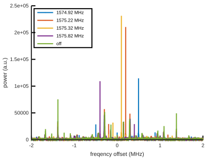
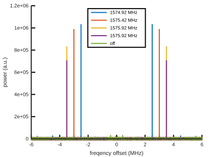
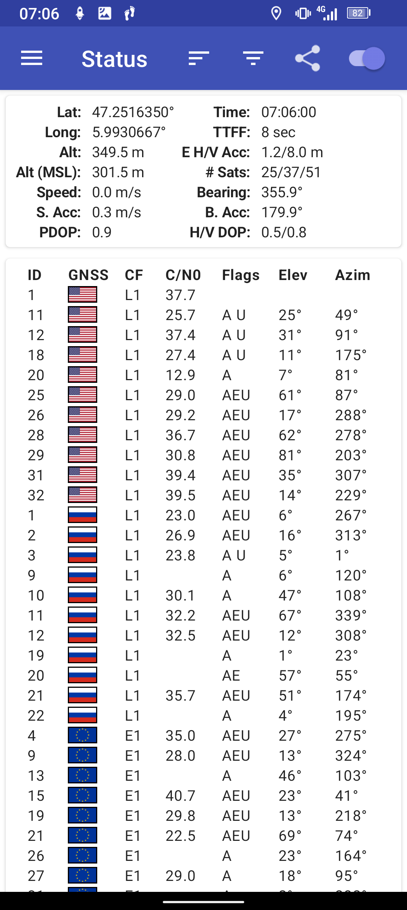
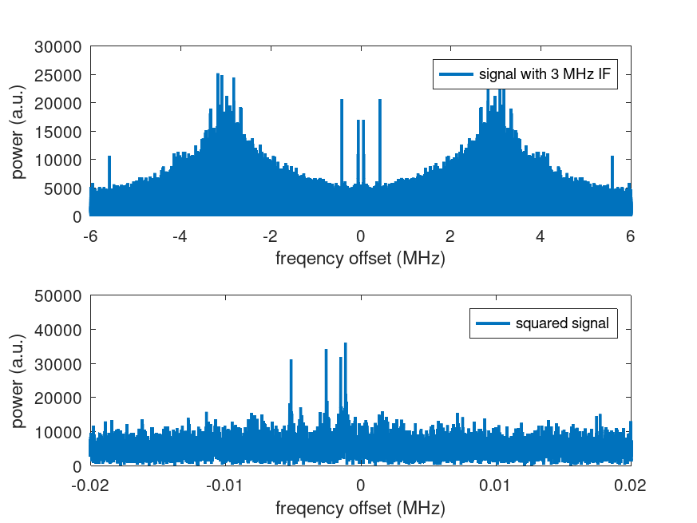

Spectra at 4 MS/s (IQ coefficients) when feeding the LNA Hi input
with various CW tone frequencies:

Spectra at 12 MS/s (I coefficients only) when feeding the LNA Hi input
with various CW tone frequencies:

Feeding the LNA Hi input with the output of a multiband GNSS antenna and
processing using ``pocket_acq.py`` from https://github.com/tomojitakasu/PocketSDR/tree/master/python

GNSS constellation observed at the same time:

Sample datasets:
* 1574p92_m90dBm_4MSps_IF0MHz.bin: continuous wave tone at 1574.92 MHz, LO frequency
at 1575.42 MHz, 8-bit IQ interleaved, 4 MHz sampling frequency
* 1575p92_m90dBm_12MSps_IF3MHz.bin: continuous wave tone at 1574.92 MHz, LO frequency
at 1572.42 MHz and 3 MHz IF, 8-bit I only, 12 MHz sampling frequency
* GPS_4MSps_IF0MHz.bin: GPS L1 antenna, LO frequency at 1575.42 MHz, 8-bit IQ interleaved, 4 MHz sampling frequency
* GPS_12MSps_IF3MHz.bin: GPS L1 antenna, LO frequency at 1575.42 MHz, 8-bit I only, 12 MHz sampling frequency 
* goCW.m: processing script for continuous wave tone analysis
* goGPS.m: processing script for GPS signal assessment, producing

