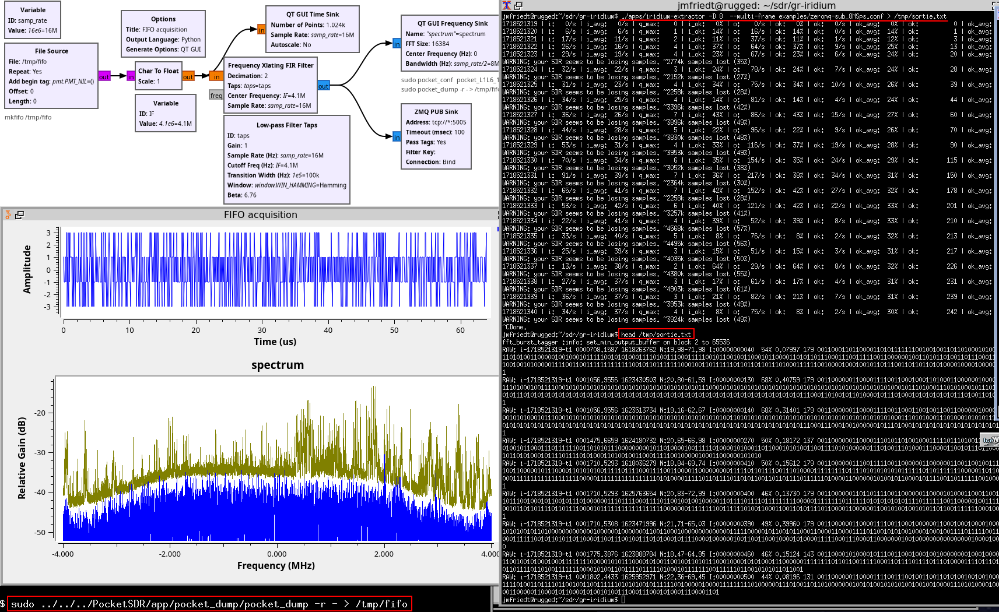
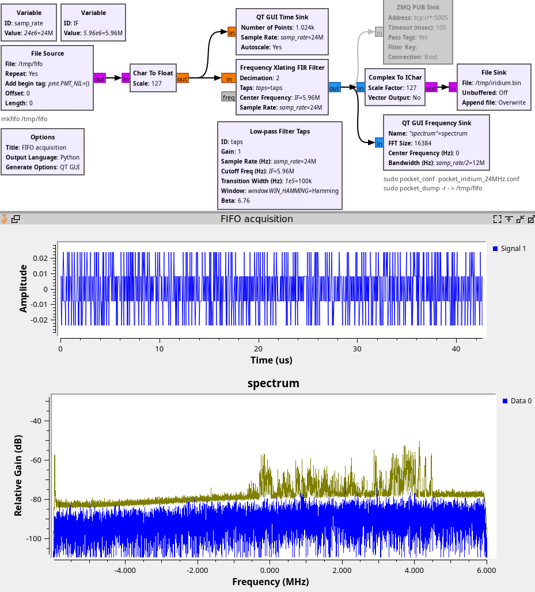

### Using the MAX2771 to receive Iridium signals

ADC clock with f(xtal)=24 MHz:
* REFFRACDIV_SEL=1, REFDIV=2 for 1/2, LCNT=2048 for 1/3: 24/2/3=4 MHz
* REFFRACDIV_SEL=1, REFDIV=0 for x2, LCNT=2048 for 1/3: 24x2/3=16 MHz
* REFFRACDIV_SEL=0: 24 MHz

LO clock with f(xtal)=24 MHz:
* 24/400x26965=1617.9 MHz


Iridium signals are short bursts so randomly sampling and displaying the 
spectra is inefficient. ``pocket_dump`` is able to stream data to stdout
so a named pipe (``mkfifo /tmp/fifo``) is used to feed a GNU Radio File Source
and display the spectra continuously.

The result looks like a convincing Iridium spectrum when executing ``pocket_dump -r - > /tmp/fifo``:


Adding a Zero-MQ Publish block allows feeding ``gr-iridium`` with the frequency transposed
and filtered output to decode the payload:



Lacking sufficient processing power on a Panasonic CF-19 laptop, we start by saving the IQ
float stream by adding a ``File Sink`` to the GNU Radio output and filling ``/tmp`` with ``iridium.bin``. 

Then if configuring the MAX2771 with ``pocket_iridium_24MHz.conf`` and GNU Radio to output
interleaved 8-bit integers (ichar) to save space:
```
gr-iridium$ apps/iridium-extractor -c 1622000000 -r 12000000 -f ci8 /tmp/iridium.bin > /tmp/output.bits
1718540521 | srr: 0.0% | i_avg:   0/s | q_max:    0 | i_ok:   0% | o:    0/s | ok:   0% | ok:   0/s | ok_avg:   0% | ok:          0 | ok_avg:   0/s | d: 0
1718540522 | srr: 261.5% | i_avg: 323/s | q_max:   62 | i_ok:  36% | o:  572/s | ok:  38% | ok: 127/s | ok_avg:  38% | ok:        128 | ok_avg: 125/s | d: 0
...
1718540541 | srr: 238.3% | i_avg: 272/s | q_max:  119 | i_ok:   0% | o:  417/s | ok:   0% | ok:   1/s | ok_avg:  45% | ok:       2463 | ok_avg: 122/s | d: 0
1718540542 | srr: 327.0% | i_avg: 268/s | q_max:  150 | i_ok:   0% | o:  454/s | ok:   0% | ok:   0/s | ok_avg:  43% | ok:       2463 | ok_avg: 117/s | d: 0
Done.

```
and
```
iridium-toolkit$ python3 -u iridium-parser.py -p /tmp/output.bits
```
outputs
```
...
IU3: u-iridium-e000 000003535.3330 1624468799  57% -56.83|-108.77|20.35 179 DL LCW(3,T:maint,C:<silent>,000000000000000000000)                                                                 RS=no [00000000 00000000 10000010 00001001 11111111 11111110 00000000 00000000 00000001 00001110 00000000 01000000 00000000 00000001 10001100 00000000 01100001 10000001 00100100 00001010 00000000 00010000 00000000 00000001 10001010 00000000 00010000 00100100 00100001 00001100 00001001 00000001 01011011 11011111 00110110 01001101 01000010 10001111 11001011]
IRA: u-iridium-e000 000003554.9184 1626302175  74% -47.11|-108.91|34.18 246 DL sat:109 beam:17 xyz=(+0977,+0111,+1251) pos=(+51.83/+006.48) alt=009 RAI:48 ?10 bc_sb:25 P01: PAGE(tmsi:98518dd8 msc_id:17) {TRUNCATED}
IIU: u-iridium-e020 000003624.8076 1624927132  66% -54.15|-109.01|22.25 179 DL LCW(1,T:hndof,C:handoff_cand,2a8,134,010101010000100110100)                                                     [10000100 10101101 00110011 00110000 00011111 01011001 01111001 11110011 10000010 10110101 00001011 10111010 10110100 11000001 11100011 10011110 01011001 01010010 00000101 01101110 10101100 11011110 11111011 11000011 01101110 01011000 10001100 01000110 10101001 11100100 01010111 00100110 10110000 00100001 10011100 11010110 10001011 10010001 00110010]
...
```
or a beautiful IRA indicating we are receiving the beam information and location of a satellite,
demonstrating proper functioning of the receiver with


