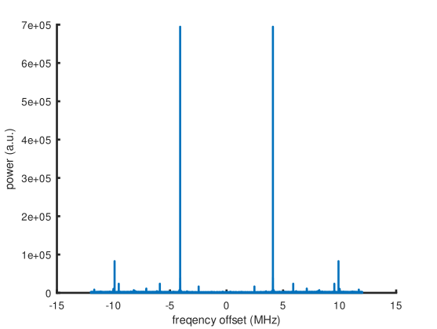

### Using the MAX2771 to receive Iridium signals

ADC clock with f(xtal)=24 MHz:
* REFFRACDIV_SEL=1, REFDIV=2 for 1/2, LCNT=2048 for 1/3: 24/2/3=4 MHz
* REFFRACDIV_SEL=1, REFDIV=0 for x2, LCNT=2048 for 1/3: 24x2/3=16 MHz
* REFFRACDIV_SEL=0: 24 MHz

LO clock with f(xtal)=24 MHz:
* 24/400x26965=1617.9 MHz

