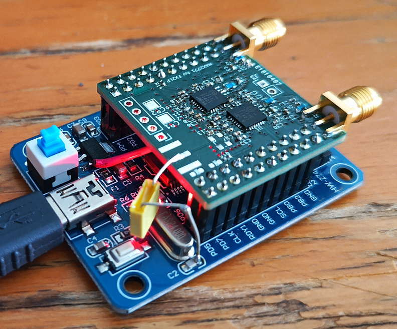

## MAX2771 multiband GNSS receiver for FX2LP

See [this movie](https://www.youtube.com/watch?v=B5UcFnkbXIk) to assess what the result of this
investigation might be. Many more GNSS bands and processing schemes are available with the very
flexible SDR reception platform. 

This project was featured on [Hackaday](https://hackaday.com/2024/11/03/gnss-reception-with-clone-sdr-board/)
November 3rd, 2024 and presented at the [2025 FOSDEM](https://www.fosdem.org/2025/schedule/event/fosdem-2025-4150-broadband-data-transfer-over-usb-for-gnu-linux-1-2-ghz-l-band-sdr-receiver-dedicated-to-gnss-and-other-reception-interfacing-with-pocketsdr-gnu-radio-and-gnss-sdr/).

### Objective: multi-MAX2771 GNSS receiver with up to 44 MS/s bulk USB communication

... for
* multiband GNSS (or other L-band signal) acquisition and processing if a power combiner 
(e.g. MiniCircuits ZAPD-2DC+) is used to feed both chips with the signal coming from a 
single multiband antenna
* CRPA (Controlled Radiation Pattern Antenna) if each chip is fed from a different
antenna for spatial diversity
* applicable to any L-band communication systems sampled with 2-3 bit ADC (verified with
Iridium)



Assembled daughter board: the missing 24 MHz oscillator is replaced with the 
24 MHz output from one of the resonator pins fitted on the FX2LP board. However,
the frequency pulling by the capacitor leads to a 3 kHz offset (2 ppm) which must
be compensated for when processing (acquisition phase of GNSS signal analysis) the
recorded signals. This feature is however illustrated to emphasize that the GNSS
receiver can be clocked by an external (24 MHz) source, a capability missing from most
commercial GNSS receivers.

Processing relies on the PocketSDR software provided by Tomoji Takasu at
https://github.com/tomojitakasu/PocketSDR.

The firmware for the FX2LP is compiled using opensource tools including the
``sdcc`` compiler, ``fx2lib`` library, ``cycfx2prog`` for prototyping the 8051 embedded
software and  ``fxload`` for flashing the onboard EEPROM.

### Getting started (assuming development on a GNU/Linux system)

1. Compile the FX2LP 8051 firmware (assumes ``sdcc`` is installed):
```
cd FX2LP/fx2lib
make
cd ../complete_fw
make
```
must complete with ``build/complete_fw.ihx`` in ``FX2LP/complete_fw``

2. Compile ``fxload`` for flashing the FX2LP
```
cd fxload
git submodule update --init
cmake .
make -j12
```

3. Flash the firmware in the FX2LP development board: switch on the board with the jumper to the bottom left (with the USB port facing
upward) closed in order to start the bootloader (``lsusb`` must return ``ID 04b4:8613 Cypress Semiconductor Corp. CY7C68013 EZ-USB FX2 
USB 2.0 Development Kit``):
```
sudo ./fxload/src/fxload load_eeprom --device 04b4:8613 --ihex-path ./FX2LP/complete_fw/build/complete_fw.ihx -t FX2LP --control-byte 0xC2 -s ./fxload/resources/Vend_Ax.hex
```
which must reply with
```
FX2:  config = 0x42, disconnected, I2C = 100 KHz
Done.
```

In case a message stating ``WARNING: don't see a large enough EEPROM`` is displayed, then the first byte of the EEPROM must be erased. To do so,
follow the sequences in ``FX2LP/bulk_read_example`` and most significantly the section about *Erase EEPROM and flash program to EEPROM*

4. Check the firmware has been flashed: switch off, remove the bottom-left jumper (to execute the firmware flashed in the EEPROM) and
restart the FX2LP: ``lsusb`` must now indicate ``ID 04b4:1004 Cypress Semiconductor Corp. There``

If so, the FX2LP is ready to communicate with PocketSDR ``app/pocket_conf/pocket_conf`` for configuring the MAX2771 (SPI communication)
or with ``app/pocket_dump/pocket_dump`` for streaming data from the FX2LP to the host computer through a USB Bulk interface.

## Cross compiling PocketSDR with Buildroot

Make sure FFTW with single precision resolution, and libusb are included 
in the Buildroot compilation toolchain.

0. in ``PocketSDR/lib/``: ``./clone_lib.sh`` as would be done on the host
1. in ``PocketSDR/lib/libfec``: 
```
./configure cross_compiling=yes --build=aarch64-buildroot-linux-gnu CC=aarch64-buildroot-linux-gnu-gcc
```
2. in ``PocketSDR/lib/build``, replace all ``CC = gcc`` in all .mk files with
``CC ?= gcc``, remove ``-DAVX2 -mavx2 -mfma`` from ``libsdr.mk``, and 
```
CC=aarch64-linux-gcc make
make install
```
3. in ``PocketSDR_RPi4/app``: edit all ``*/makefile`` and replace ``CC = g..``
with ``CC ?= g..`` (where .. is ``cc`` or ``++``), remove ``-DAVX2 -mavx2 -mfma``
from the ``pocket_snap`` makefile, and in ``makefile`` replace 
all ``make -C`` with ``CC=aarch64-linux-gcc make -C``
4. on a Raspberry Pi, make sure to increase CPU performance:
```
echo "performance" > /sys/devices/system/cpu/cpu0/cpufreq/scaling_governor
```
5. on a Raspberry Pi, make sure to write to a ramfs rather than the slow
SD card (``/tmp`` must be a tmpfs)

```
# ./app/pocket_dump/pocket_dump -t 10 /tmp/1.bin /tmp/2.bin
  TIME(s)    T   CH1(Bytes)   T   CH2(Bytes)   RATE(Ks/s)
     10.0   IQ     79953920  IQ     79953920       3995.3
# lsusb
Bus 001 Device 001: ID 1d6b:0002
Bus 001 Device 003: ID 04b4:1004
Bus 001 Device 002: ID 2109:3431
Bus 002 Device 001: ID 1d6b:0003
# uname -a
Linux buildroot 6.6.28-v8 #1 SMP PREEMPT Mon Feb  3 08:00:06 UTC 2025 aarch64 GNU/Linux
```
and the acqisition is validated on the host (the Raspberry Pi is lacking matplotlib and scipy)
with ``python3 python/pocket_acq.py -f 4  -sig L1CA -prn 1-32 /tmp/2.bin``
