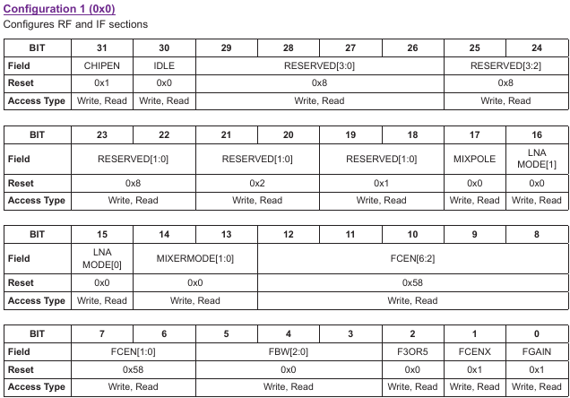
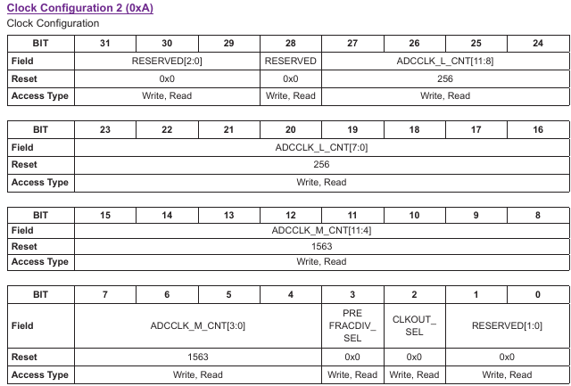

## Testing hardware functionality

Assuming both MAX2771 are fitted with the inductor and capacitor for reaching the upper L-band (L1)
and that LNAHi is connected to MixHi using the appropriate straps (0402 resistors), then
* flash the ``../FX2LP/pocket_fw_FE_2CH_v2.1.hex`` official firmware from the PocketSDR in the FX2LP board
EEPROM. This is achieved by removing the EEPROM jumper, checking with ``lsusb`` that the EZ USB appears
as
```
Bus 001 Device 080: ID 04b4:8613 Cypress Semiconductor Corp. CY7C68013 EZ-USB FX2 USB 2.0 Development Kit
```
is with VID=04B4 et PID=8613. Notice the bus number and device number and use them as argument to ``fxload``
```
sudo ./fxload -D /dev/bus/usb/001/080 -I ../FX2LP/pocket_fw_FE_2CH_v2.1.hex -c 0xc2 -s Vend_Ax.hex -t fx2lp
```
executed from the ``fxload`` directory (where ``Vend_Ax.hex`` is located) will flash the EEPROM. Power off
and back on the FX2LP and now the peripheral should appear as
```
Bus 001 Device 081: ID 04b4:1004 Cypress Semiconductor Corp. EZ-USB
```
i.e. VID=04B4 et PID=1004.
* in order to generate a known GNSS signal for qualifying the MAX2771 circuits, run ``pluto-gps-sim`` on a 
PlutoSDR whose output is connected to a ZAPD-2-21-3W-S splitter feeding both MAX2771 inputs with
```
$ ./pluto-gps-sim -e hour0730.20n -U usb:1.69.5 -A -60.0 -t 2020/03/13,18:00:00 -l 48.3621221,-4.8223307,100
Using static location mode.
Gain: -60.0dB
RINEX date = 13-MAR-20 13:26
Start time = 2020/03/13,18:00:00 (2096:496800)
PRN   Az    El     Range     Iono
04  277.8   0.6  25711398.4   9.1
05   20.6   2.4  25438648.9   5.3
...
```


* configure the MAX2771 to analyze the L1 band with 8 MHz bandwidth and 2 MHz IF:
```
$ sudo ./app/pocket_conf/pocket_conf conf/pocket_L1L1_8MHz.conf 
$ sudo ./app/pocket_conf/pocket_conf | head
#
#  Pocket SDR device settings (MAX2771)
#
#  [CH1] F_LO = 1573.420 MHz, F_ADC =  8.000 MHz (I ), F_FILT =  2.0 MHz, BW_FILT =  2.5 MHz
#  [CH2] F_LO = 1573.420 MHz, F_ADC =  0.000 MHz (I ), F_FILT =  2.0 MHz, BW_FILT =  2.5 MHz

[CH1]
LNAMODE         =       0  # LNA mode selection (0:high-band,1:low-band,2:disable)
MIXERMODE       =       0  # Mixer mode selection (0:high-band,1:low-band,2:disable)
FCEN            =     107  # IF filter center frequency: (128-FCEN)/2*{0.195|0.66|0.355} MHz
```
*  record a short dataset
```
$ sudo /home/jmfriedt/sdr/max2771/PocketSDR/app/pocket_dump/pocket_dump -t 2 ch1.bin ch2.bin
  TIME(s)    T   CH1(Bytes)   T   CH2(Bytes)   RATE(Ks/s)
      2.0    I     15990784   I     15990784       7979.4
```
* verify that the recorded data are properly decoded:
```
python3 ./python/pocket_acq.py ch1.bin -f 8 -fi 2 -sig L1CA -prn 1-32
python3 ./python/pocket_acq.py ch2.bin -f 8 -fi 2 -sig L1CA -prn 1-32
```
will display something like
```
SIG= L1CA, PRN=   1, COFF=  0.26000 ms, DOP=   646 Hz, C/N0= 36.0 dB-Hz
SIG= L1CA, PRN=   2, COFF=  0.28388 ms, DOP= -1575 Hz, C/N0= 36.4 dB-Hz
SIG= L1CA, PRN=   3, COFF=  0.46550 ms, DOP=  5000 Hz, C/N0= 35.4 dB-Hz
SIG= L1CA, PRN=   4, COFF=  0.15050 ms, DOP= -1985 Hz, C/N0= 43.5 dB-Hz
SIG= L1CA, PRN=   5, COFF=  0.18775 ms, DOP= -1808 Hz, C/N0= 43.7 dB-Hz
SIG= L1CA, PRN=   6, COFF=  0.38313 ms, DOP= -1080 Hz, C/N0= 35.7 dB-Hz
SIG= L1CA, PRN=   7, COFF=  0.26287 ms, DOP= -1376 Hz, C/N0= 35.4 dB-Hz
SIG= L1CA, PRN=   8, COFF=  0.94950 ms, DOP=  3677 Hz, C/N0= 43.9 dB-Hz
SIG= L1CA, PRN=   9, COFF=  0.73050 ms, DOP= -1057 Hz, C/N0= 43.5 dB-Hz
SIG= L1CA, PRN=  10, COFF=  0.02925 ms, DOP=  3881 Hz, C/N0= 43.3 dB-Hz
SIG= L1CA, PRN=  11, COFF=  0.49300 ms, DOP=    45 Hz, C/N0= 35.3 dB-Hz
SIG= L1CA, PRN=  12, COFF=  0.07437 ms, DOP= -5000 Hz, C/N0= 35.2 dB-Hz
SIG= L1CA, PRN=  13, COFF=  0.45588 ms, DOP=  3208 Hz, C/N0= 35.5 dB-Hz
SIG= L1CA, PRN=  14, COFF=  0.60138 ms, DOP= -1294 Hz, C/N0= 35.9 dB-Hz
SIG= L1CA, PRN=  15, COFF=  0.85925 ms, DOP=  4637 Hz, C/N0= 35.9 dB-Hz
SIG= L1CA, PRN=  16, COFF=  0.94663 ms, DOP=  1854 Hz, C/N0= 52.7 dB-Hz
SIG= L1CA, PRN=  17, COFF=  0.82413 ms, DOP= -3512 Hz, C/N0= 35.4 dB-Hz
SIG= L1CA, PRN=  18, COFF=  0.82712 ms, DOP=  1843 Hz, C/N0= 35.9 dB-Hz
SIG= L1CA, PRN=  19, COFF=  0.82988 ms, DOP= -4451 Hz, C/N0= 35.6 dB-Hz
SIG= L1CA, PRN=  20, COFF=  0.74013 ms, DOP=  3439 Hz, C/N0= 47.5 dB-Hz
SIG= L1CA, PRN=  21, COFF=  0.04425 ms, DOP=  -542 Hz, C/N0= 52.7 dB-Hz
SIG= L1CA, PRN=  22, COFF=  0.04988 ms, DOP=  -534 Hz, C/N0= 35.6 dB-Hz
SIG= L1CA, PRN=  23, COFF=  0.56900 ms, DOP=  -611 Hz, C/N0= 35.9 dB-Hz
SIG= L1CA, PRN=  24, COFF=  0.67950 ms, DOP= -1601 Hz, C/N0= 36.2 dB-Hz
SIG= L1CA, PRN=  25, COFF=  0.46575 ms, DOP=   -50 Hz, C/N0= 36.0 dB-Hz
SIG= L1CA, PRN=  26, COFF=  0.81225 ms, DOP=   -19 Hz, C/N0= 54.2 dB-Hz
SIG= L1CA, PRN=  27, COFF=  0.31013 ms, DOP=  3064 Hz, C/N0= 50.1 dB-Hz
SIG= L1CA, PRN=  28, COFF=  0.84475 ms, DOP=  4047 Hz, C/N0= 36.1 dB-Hz
SIG= L1CA, PRN=  29, COFF=  0.11050 ms, DOP= -2670 Hz, C/N0= 46.2 dB-Hz
SIG= L1CA, PRN=  30, COFF=  0.98950 ms, DOP=  -610 Hz, C/N0= 35.4 dB-Hz
SIG= L1CA, PRN=  31, COFF=  0.15950 ms, DOP= -3009 Hz, C/N0= 47.2 dB-Hz
SIG= L1CA, PRN=  32, COFF=  0.07250 ms, DOP=  -887 Hz, C/N0= 35.3 dB-Hz
TIME = 6.129 s
```
with PRN 4, 5, 8, 9, 10, 16, 20, 21, 26, 29, 31 highlighted in blue, matching the 
signals broadcast by ``pluto-gps-sim``.

### setting ADC speed

ADC clock with f(xtal)=24 MHz:

```
REFFRACDIV_SEL=1, REFDIV=3 for x1, LCNT=2048 for 1/3: 24x1/3=8 MHz
```

since 

```
* PREFRACDIV_SEL  =       1  # Clock pre-divider selection (0:bypass,1:enable)
* REFCLK_L_CNT    =    2048  # Clock pre-divider L counter value (0-4095): L_CNT/(4096-M_CNT+L_CNT)
* REFCLK_M_CNT    =       0  # Clock pre-divider M counter value (0-4095)
* ADCCLK          =       0  # Integer clock div/mul selection (0:enable,1:bypass)
* REFDIV          =       3  # Integer clock div/mul ratio (0:x2,1:1/4,2:1/2,3:x1,4:x4)
* FCLKIN          =       0  # ADC clock divider selection (0:bypass,1:enable)
* ADCCLK_L_CNT    =       0  # ADC clock divider L counter value (0-4095): L_CNT/(4096-M_CNT+L_CNT)
* ADCCLK_M_CNT    =       0  # ADC clock divider M counter value (0-4095)
```

### Checking register writing and reading

From the MAX2771, registers 0 and 10 are organized as follows with their default value at reset





so that for register 0: 10100010001001000001011000000011 split as nibbles with 1010 0010 0010 0100 0001 0110 0000 0011 interpreted as 0xA2241603

and for register 10: 00000001000000000110000110110000 split as nibbles with 0000 0001 0000 0000 0110 0001 1011 0000 interpreted
 as 0x10061B0. After setting Lcount to 2048 and Mcount to 0 with RefDiv=3 (for keeping the 24 MHz clock and dividing by 3
to reach a sampling rate of 8 MHz), register 10 should become 0x08000000C.

Reading and writing these register values with the original PocketSDR firmware or with our SDCC generated firmware
led to opposite endianneess reports, leading to the discovery that Keil and SDCC compilers are opposite endianness
and that the cast from ``char*`` to ``int32_t`` would swap bytes if not taken care of manually. The SDCC code was
corrected accordingly.
