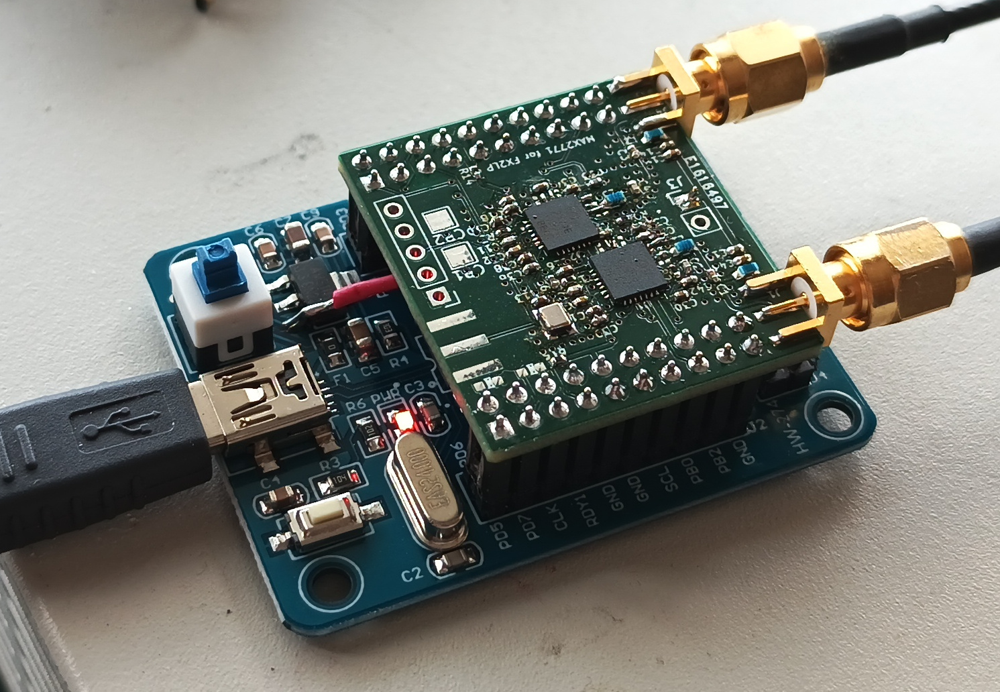

Recording with 2 MHz IF at 8 MS/s centered on GPS L1 C/A band-2 MHz (see ``pocket_L1L1_8MHz.conf``).

Processing using ``gnss-sdr`` (v.0.0.19) to reach a PVT solution:

```
$ gnss-sdr -c File_GPS_L1_char.conf
...
New GPS NAV message received in channel 4: subframe 2 from satellite GPS PRN 02 (Block IIR) with CN0=39 dB-Hz
New GPS NAV message received in channel 3: subframe 2 from satellite GPS PRN 32 (Block IIF) with CN0=48 dB-Hz
New GPS NAV message received in channel 1: subframe 2 from satellite GPS PRN 10 (Block IIF) with CN0=47 dB-Hz
New GPS NAV message received in channel 7: subframe 2 from satellite GPS PRN 27 (Block IIF) with CN0=42 dB-Hz
Current receiver time: 2 min 2 s
Current receiver time: 2 min 3 s
Current receiver time: 2 min 4 s
Current receiver time: 2 min 5 s
Current receiver time: 2 min 6 s
Loss of lock in channel 10!
Tracking of GPS L1 C/A signal started on channel 10 for satellite GPS PRN 19 (Block IIR)
Current receiver time: 2 min 7 s
New GPS NAV message received in channel 4: subframe 3 from satellite GPS PRN 02 (Block IIR) with CN0=38 dB-Hz
New GPS NAV message received in channel 3: subframe 3 from satellite GPS PRN 32 (Block IIF) with CN0=48 dB-Hz
New GPS NAV message received in channel 1: subframe 3 from satellite GPS PRN 10 (Block IIF) with CN0=46 dB-Hz
New GPS NAV message received in channel 7: subframe 3 from satellite GPS PRN 27 (Block IIF) with CN0=41 dB-Hz
Current receiver time: 2 min 8 s
First position fix at 2024-Jul-07 11:09:30.240000 UTC is Lat = 47.2486 [deg], Long = 6.02072 [deg], Height= 377.076 [m]
Current receiver time: 2 min 9 s
Loss of lock in channel 0!
```

or for another run, since ``gnss-sdr`` is not deterministic (this time using SV 08, 10, 21, and 32
instead of 02, 10, 27 and 32):

```
$ gnss-sdr -c File_GPS_L1_char.conf
...
Current receiver time: 2 min 7 s
New GPS NAV message received in channel 6: subframe 3 from satellite GPS PRN 21 (Block IIR) with CN0=40 dB-Hz
New GPS NAV message received in channel 8: subframe 3 from satellite GPS PRN 08 (Block IIF) with CN0=41 dB-Hz
New GPS NAV message received in channel 10: subframe 3 from satellite GPS PRN 32 (Block IIF) with CN0=48 dB-Hz
New GPS NAV message received in channel 1: subframe 3 from satellite GPS PRN 10 (Block IIF) with CN0=46 dB-Hz
Current receiver time: 2 min 8 s
First position fix at 2024-Jul-07 11:09:30.260000 UTC is Lat = 47.2488 [deg], Long = 6.02057 [deg], Height= 400.392 [m]
Current receiver time: 2 min 9 s
Loss of lock in channel 0!
Tracking of GPS L1 C/A signal started on channel 0 for satellite GPS PRN 01 (Block IIF)
Loss of lock in channel 2!
Tracking of GPS L1 C/A signal started on channel 2 for satellite GPS PRN 25 (Block IIF)
Loss of lock in channel 3!
Tracking of GPS L1 C/A signal started on channel 3 for satellite GPS PRN 11 (Block III)
Loss of lock in channel 4!
Tracking of GPS L1 C/A signal started on channel 4 for satellite GPS PRN 26 (Block IIF)
Loss of lock in channel 5!
Tracking of GPS L1 C/A signal started on channel 5 for satellite GPS PRN 24 (Block IIF)
Loss of lock in channel 7!
Tracking of GPS L1 C/A signal started on channel 7 for satellite GPS PRN 22 (Block IIR)
Loss of lock in channel 9!
Tracking of GPS L1 C/A signal started on channel 9 for satellite GPS PRN 09 (Block IIF)
Loss of lock in channel 11!
Tracking of GPS L1 C/A signal started on channel 11 for satellite GPS PRN 02 (Block IIR)
Current receiver time: 2 min 10 s
Current receiver time: 2 min 11 s
Current receiver time: 2 min 12 s
Current receiver time: 2 min 13 s
New GPS NAV message received in channel 6: subframe 4 from satellite GPS PRN 21 (Block IIR) with CN0=39 dB-Hz
New GPS NAV message received in channel 8: subframe 4 from satellite GPS PRN 08 (Block IIF) with CN0=42 dB-Hz
New GPS NAV message received in channel 10: subframe 4 from satellite GPS PRN 32 (Block IIF) with CN0=49 dB-Hz
New GPS NAV message received in channel 1: subframe 4 from satellite GPS PRN 10 (Block IIF) with CN0=45 dB-Hz
Current receiver time: 2 min 14 s
Current receiver time: 2 min 15 s
Current receiver time: 2 min 16 s
Current receiver time: 2 min 17 s
Current receiver time: 2 min 18 s
Current receiver time: 2 min 19 s
New GPS NAV message received in channel 6: subframe 5 from satellite GPS PRN 21 (Block IIR) with CN0=39 dB-Hz
New GPS NAV message received in channel 8: subframe 5 from satellite GPS PRN 08 (Block IIF) with CN0=41 dB-Hz
New GPS NAV message received in channel 10: subframe 5 from satellite GPS PRN 32 (Block IIF) with CN0=47 dB-Hz
New GPS NAV message received in channel 1: subframe 5 from satellite GPS PRN 10 (Block IIF) with CN0=45 dB-Hz
Position at 2024-Jul-07 11:09:42.000000 UTC using 4 observations is Lat = 47.248735 [deg], Long = 6.020525 [deg], Height = 381.44 [m]
Velocity: East: -0.74 [m/s], North: -0.49 [m/s], Up = -1.97 [m/s]
Current receiver time: 2 min 20 s
Current receiver time: 2 min 21 s
Current receiver time: 2 min 22 s
Current receiver time: 2 min 23 s
Current receiver time: 2 min 24 s
Current receiver time: 2 min 25 s
Loss of lock in channel 0!
Tracking of GPS L1 C/A signal started on channel 0 for satellite GPS PRN 01 (Block IIF)
Loss of lock in channel 2!
Tracking of GPS L1 C/A signal started on channel 2 for satellite GPS PRN 25 (Block IIF)
Loss of lock in channel 3!
Loss of lock in channel 4!
Tracking of GPS L1 C/A signal started on channel 3 for satellite GPS PRN 11 (Block III)
Loss of lock in channel 5!
Tracking of GPS L1 C/A signal started on channel 4 for satellite GPS PRN 17 (Block IIR-M)
Tracking of GPS L1 C/A signal started on channel 5 for satellite GPS PRN 28 (Block IIR)
Loss of lock in channel 7!
Tracking of GPS L1 C/A signal started on channel 7 for satellite GPS PRN 22 (Block IIR)
Loss of lock in channel 9!
Tracking of GPS L1 C/A signal started on channel 9 for satellite GPS PRN 09 (Block IIF)
Loss of lock in channel 11!
Tracking of GPS L1 C/A signal started on channel 11 for satellite GPS PRN 02 (Block IIR)
New GPS NAV message received in channel 6: subframe 1 from satellite GPS PRN 21 (Block IIR) with CN0=40.70 dB-Hz
New GPS NAV message received in channel 8: subframe 1 from satellite GPS PRN 08 (Block IIF) with CN0=40.58 dB-Hz
New GPS NAV message received in channel 10: subframe 1 from satellite GPS PRN 32 (Block IIF) with CN0=48.45 dB-Hz
New GPS NAV message received in channel 1: subframe 1 from satellite GPS PRN 10 (Block IIF) with CN0=45.20 dB-Hz
Current receiver time: 2 min 26 s
Current receiver time: 2 min 27 s
Current receiver time: 2 min 28 s
Current receiver time: 2 min 29 s
Current receiver time: 2 min 30 s
Current receiver time: 2 min 31 s
New GPS NAV message received in channel 6: subframe 2 from satellite GPS PRN 21 (Block IIR) with CN0=40.12 dB-Hz
New GPS NAV message received in channel 8: subframe 2 from satellite GPS PRN 08 (Block IIF) with CN0=40.72 dB-Hz
New GPS NAV message received in channel 10: subframe 2 from satellite GPS PRN 32 (Block IIF) with CN0=48.75 dB-Hz
New GPS NAV message received in channel 1: subframe 2 from satellite GPS PRN 10 (Block IIF) with CN0=45.09 dB-Hz
Current receiver time: 2 min 32 s
Current receiver time: 2 min 33 s
Current receiver time: 2 min 34 s
Current receiver time: 2 min 35 s
Current receiver time: 2 min 36 s
Current receiver time: 2 min 37 s
New GPS NAV message received in channel 6: subframe 3 from satellite GPS PRN 21 (Block IIR) with CN0=38.76 dB-Hz
New GPS NAV message received in channel 8: subframe 3 from satellite GPS PRN 08 (Block IIF) with CN0=40.89 dB-Hz
New GPS NAV message received in channel 10: subframe 3 from satellite GPS PRN 32 (Block IIF) with CN0=49.17 dB-Hz
New GPS NAV message received in channel 1: subframe 3 from satellite GPS PRN 10 (Block IIF) with CN0=45.04 dB-Hz
Current receiver time: 2 min 38 s
Current receiver time: 2 min 39 s
Current receiver time: 2 min 40 s
Current receiver time: 2 min 41 s
Loss of lock in channel 0!
Tracking of GPS L1 C/A signal started on channel 0 for satellite GPS PRN 01 (Block IIF)
Loss of lock in channel 2!
Tracking of GPS L1 C/A signal started on channel 2 for satellite GPS PRN 25 (Block IIF)
Loss of lock in channel 3!
Loss of lock in channel 4!
Tracking of GPS L1 C/A signal started on channel 3 for satellite GPS PRN 11 (Block III)
Tracking of GPS L1 C/A signal started on channel 4 for satellite GPS PRN 29 (Block IIR-M)
Loss of lock in channel 5!
Tracking of GPS L1 C/A signal started on channel 5 for satellite GPS PRN 28 (Block IIR)
Loss of lock in channel 7!
Tracking of GPS L1 C/A signal started on channel 7 for satellite GPS PRN 22 (Block IIR)
Loss of lock in channel 9!
Tracking of GPS L1 C/A signal started on channel 9 for satellite GPS PRN 09 (Block IIF)
Loss of lock in channel 11!
Tracking of GPS L1 C/A signal started on channel 11 for satellite GPS PRN 02 (Block IIR)
Current receiver time: 2 min 42 s
Current receiver time: 2 min 43 s
New GPS NAV message received in channel 6: subframe 4 from satellite GPS PRN 21 (Block IIR) with CN0=39.06 dB-Hz
New GPS NAV message received in channel 8: subframe 4 from satellite GPS PRN 08 (Block IIF) with CN0=40.46 dB-Hz
New GPS NAV message received in channel 10: subframe 4 from satellite GPS PRN 32 (Block IIF) with CN0=49.52 dB-Hz
New GPS NAV message received in channel 1: subframe 4 from satellite GPS PRN 10 (Block IIF) with CN0=44.56 dB-Hz
Current receiver time: 2 min 44 s
Current receiver time: 2 min 45 s
Current receiver time: 2 min 46 s
Current receiver time: 2 min 47 s
Current receiver time: 2 min 48 s
Current receiver time: 2 min 49 s
New GPS NAV message received in channel 6: subframe 5 from satellite GPS PRN 21 (Block IIR) with CN0=39.34 dB-Hz
New GPS NAV message received in channel 8: subframe 5 from satellite GPS PRN 08 (Block IIF) with CN0=39.10 dB-Hz
New GPS NAV message received in channel 10: subframe 5 from satellite GPS PRN 32 (Block IIF) with CN0=50.16 dB-Hz
New GPS NAV message received in channel 1: subframe 5 from satellite GPS PRN 10 (Block IIF) with CN0=44.66 dB-Hz
Position at 2024-Jul-07 11:10:11.989167 UTC using 4 observations is Lat = 47.248775 [deg], Long = 6.019693 [deg], Height = 330.00 [m]
Velocity: East: -0.54 [m/s], North: 2.02 [m/s], Up = 1.62 [m/s]
...
```

Experimental setup: notice the 24 MHz oscillator:



Constellation observation using a mobile phone identifying GPS SV 2, 10, 27 and 32 as most powerful signals:


