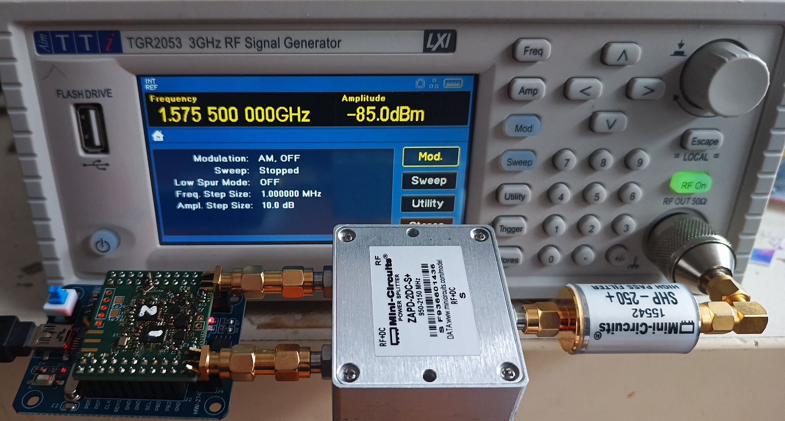
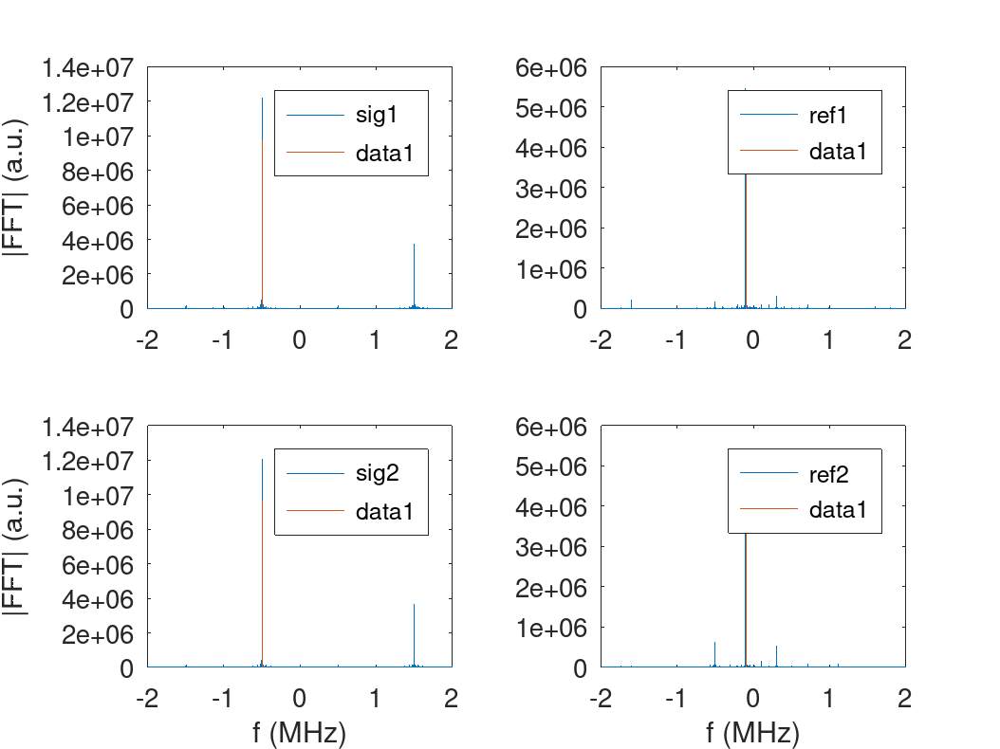

# Circuit verification

Script for validating the proper operation of the circuit, including the 
reference oscillator and RF switch for phase calibration.

The synthesizer is set to 1575.5 MHz at a power of -85 dBm (-88 dBm after the
splitter) with the high-pass filter acting as a DC blocker, and the MAX2771
LO programmed to 1575 MHz, so the beatnote must be at -500 kHz (I-jQ inverts
the frequency sign). The reference oscillator is 312.5 MHz whose 5th harmonics
reaches 1562.5 MHz while the LO configuration is set to 1562.4 MHz so the 
beatnote must be at -100 kHz.

On each chart, the red vertical line indicates the expected beatnote expected
spectral component position. If the spectrum does not exhibit a main spectral
component at this frequency, the circuit is faulty.

As an example of the properly working circuit output:

