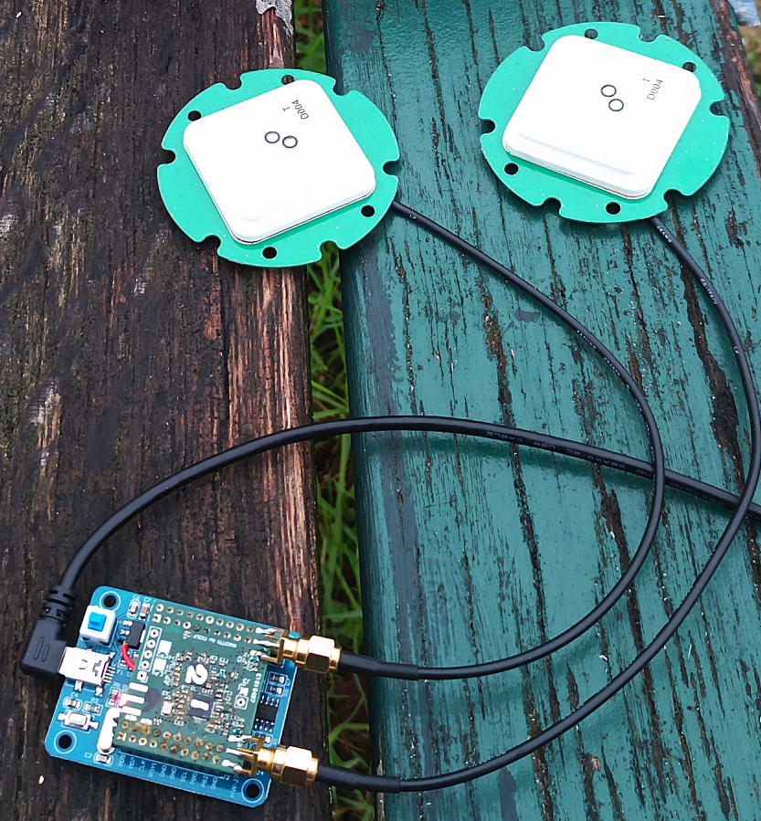

# Circuit verification

## Synthetic signals

Script for validating the proper operation of the circuit, including the 
reference oscillator and RF switch for phase calibration.


The synthesizer is set to 1575.5 MHz at a power of -85 dBm (-88 dBm after the
splitter) with the high-pass filter acting as a DC blocker, and the MAX2771
LO programmed to 1575 MHz, so the beatnote must be at -500 kHz (I-jQ inverts
the frequency sign). The reference oscillator is 312.5 MHz whose 5th harmonics
reaches 1562.5 MHz while the LO configuration is set to 1562.4 MHz so the 
beatnote must be at -100 kHz.

On each chart, the red vertical line indicates the expected beatnote expected
spectral component position. If the spectrum does not exhibit a main spectral
component at this frequency, the circuit is faulty.

As an example of the properly working circuit output:


## Real signals

Two <a href="https://www.ardusimple.com/product/antenna-for-gnss-multiband-oem/">Ardusimple OEM</a>
antennas are connected to each input, both MAX2771 wired for L1 (upper L-band) inputs. The
``gnss-sdr`` configuration <a href="File_GPS_L1_char.conf">file</a> is used to acquire and 
track the signal until a PVT solution is reached.

A typical configuration sequence is
```
sudo ../PocketSDR/app/pocket_conf/pocket_conf pocket_L1L1_4MHz.conf
sudo ../max2771_fx2lp/verification/vendor_cmd.py 0
sudo ../PocketSDR/app/pocket_dump/pocket_dump -t 360 ./1_4MSps.bin ./2_4MSps.bin
```

leading to processing channel 1: 
```
Current receiver time: 3 min 14 s
Current receiver time: 3 min 15 s
Current receiver time: 3 min 16 s
New GPS NAV message received in channel 1: subframe 3 from satellite GPS PRN 29 (Block IIR-M) with CN0=43 dB-Hz
New GPS NAV message received in channel 3: subframe 3 from satellite GPS PRN 31 (Block IIR-M) with CN0=40 dB-Hz
New GPS NAV message received in channel 5: subframe 3 from satellite GPS PRN 26 (Block IIF) with CN0=39 dB-Hz
New GPS NAV message received in channel 0: subframe 3 from satellite GPS PRN 25 (Block IIF) with CN0=40 dB-Hz
Current receiver time: 3 min 17 s
First position fix at 2025-Dec-22 15:40:30.340000 UTC is Lat = 48.8XXX [deg], Long = 2.2XXX [deg], Height= 97.8233 [m]
Position at 2025-Dec-22 15:40:31.000000 UTC using 3 observations is Lat = 48.8XXXXX [deg], Long = 2.2XXXXX [deg], Height = 96.40 [m]
Velocity: East: 599.06 [m/s], North: -2308.52 [m/s], Up = 1586.09 [m/s]
Current receiver time: 3 min 18 s
Position at 2025-Dec-22 15:40:32.000000 UTC using 2 observations is Lat = 48.8XXXXX [deg], Long = 2.2XXXXX [deg], Height = 99.13 [m]
Velocity: East: 599.77 [m/s], North: -2306.04 [m/s], Up = 1589.18 [m/s]
Current receiver time: 3 min 19 s
Position at 2025-Dec-22 15:40:33.000000 UTC using 2 observations is Lat = 48.8XXXXX [deg], Long = 2.2XXXXX [deg], Height = 107.62 [m]
Velocity: East: 599.41 [m/s], North: -2307.94 [m/s], Up = 1590.02 [m/s]
```

and channel 2:
```
Current receiver time: 45 s
Current receiver time: 46 s
New GPS NAV message received in channel 3: subframe 3 from satellite GPS PRN 31 (Block IIR-M) with CN0=42 dB-Hz
New GPS NAV message received in channel 2: subframe 3 from satellite GPS PRN 28 (Block IIR) with CN0=44 dB-Hz
New GPS NAV message received in channel 0: subframe 3 from satellite GPS PRN 25 (Block IIF) with CN0=41 dB-Hz
New GPS NAV message received in channel 4: subframe 3 from satellite GPS PRN 26 (Block IIF) with CN0=39 dB-Hz
GPS L1 C/A tracking bit synchronization locked in channel 1 for satellite GPS PRN 29 (Block IIR-M)
First position fix at 2025-Dec-22 15:38:00.120000 UTC is Lat = 48.8XX [deg], Long = 2.2XXXX [deg], Height= 124.894 [m]
Current receiver time: 47 s
Position at 2025-Dec-22 15:38:01.000000 UTC using 2 observations is Lat = 48.8XXXXX [deg], Long = 2.2XXXXX [deg], Height = 113.48 [m]
Velocity: East: 1098.92 [m/s], North: -692.28 [m/s], Up = 2219.84 [m/s]
Current receiver time: 48 s
Position at 2025-Dec-22 15:38:01.988084 UTC using 4 observations is Lat = 48.8XXXXX [deg], Long = 2.2XXXXX [deg], Height = 177.69 [m]
Velocity: East: 1098.92 [m/s], North: -692.35 [m/s], Up = 2221.27 [m/s]
Current receiver time: 49 s
Loss of lock in channel 5!
```


